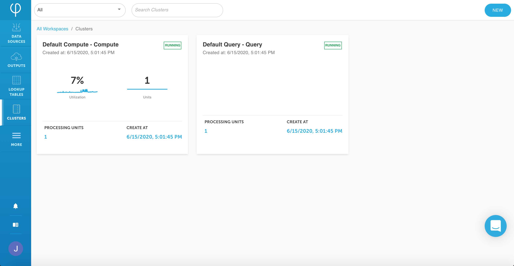

# Clusters

## Cluster types



Used for computing for data sources and outputs.  
**See:** [Compute cluster](cluster-types/adding-a-compute-cluster.md)



Used for querying lookup tables externally in real time \(from external code\).  
**See:** [Query cluster](cluster-types/adding-a-query-cluster.md)



Used for integration with the Upsolver API.  
**See:** [Local API cluster](cluster-types/adding-a-local-api-cluster.md)



## Viewing clusters

The **Clusters** page shows you all your clusters in a grid view. 

They can be filtered by the type of cluster \(e.g. select Compute to only view compute clusters\) or by the name through search.


The cluster panel shows:

* name of the cluster
* when it was created
* percentage of utilization
* how many processing units it uses
* whether it is running


You can click on a specific cluster to view more details:

* [Monitoring](monitoring-clusters.md)
* [Tasks](cluster-tasks.md)
* [Elastic IPs](cluster-elastic-ips.md)
* [Properties](cluster-properties.md)

Within a specific cluster, you also have the option to:

* **stop** — stops the cluster from running.
* **edit** — reconfigure cluster options.
* **roll** — restarts the cluster.

