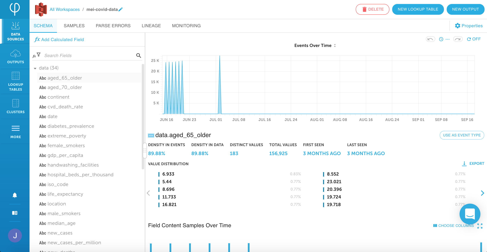
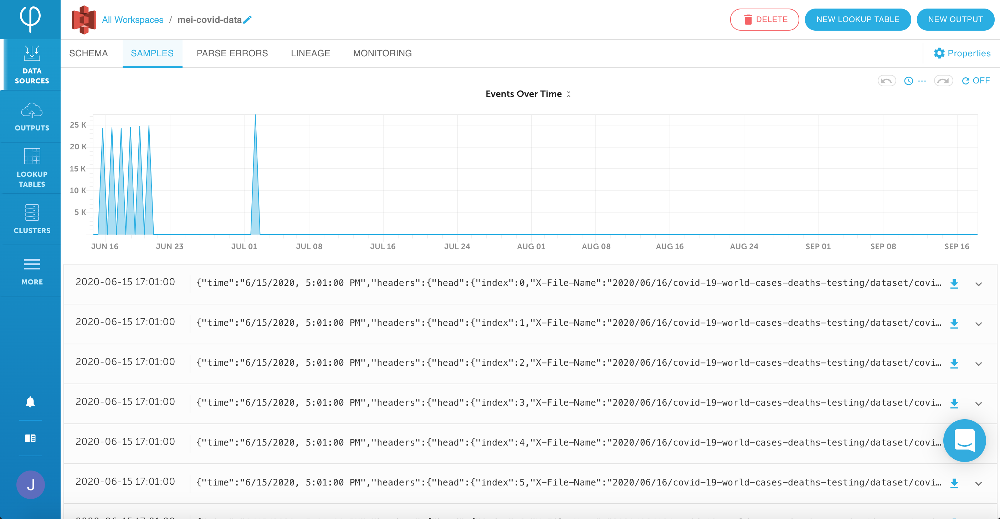
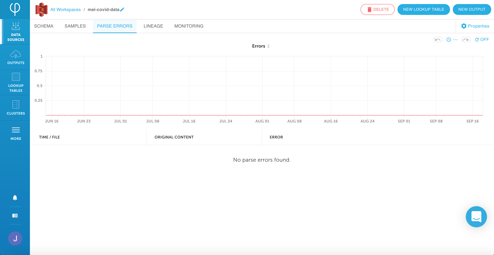
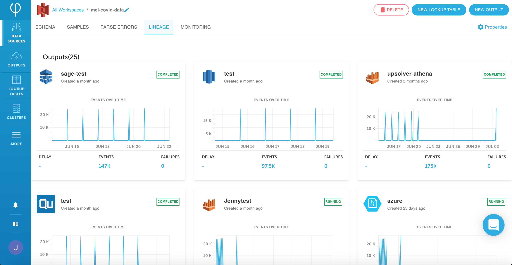
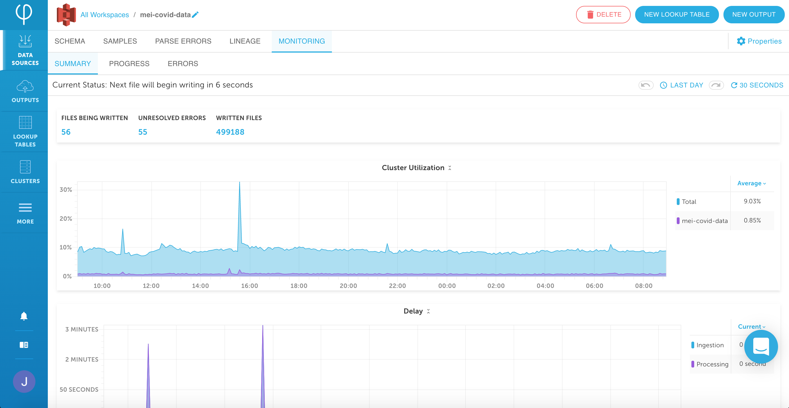

# Data source UI


Click on a data source in the **Data Sources** page to view more details for that data source.


The information on that data source will be split into:

* [Schema](data-source-ui-tour.md#data-source-schema)
* [Samples](data-source-ui-tour.md#data-source-samples)
* [Parse errors](data-source-ui-tour.md#parse-errors)
* [Lineage](data-source-ui-tour.md#lineage)
* [Monitoring](data-source-ui-tour.md#monitoring)
* [Properties](data-source-properties.md)

## Data source schema

Upsolver maintains the hierarchical format of the ingested data. 

The tree on the left includes the **data** and **headers** ingested, as well as any fields added by Upsolver to the header \(e.g. **time**\) as well as any calculated fields that may have been added.

The pane on the right show a graph of the volume of events over the lifetime of the data source. If a field is selected, it shows the events graph for that specific field.

You can also explore your data source from a different angle by splitting up the data and configuring a field to **Use as Event Type**. 

This allows you to filter your data source by event type and see how the rest of the fields in your data set are affected by this selection; this can be useful when you have different types of data in the same stream, or if you have a very large data set and only want to view some of the data.


**Note:** The **Use as Event Type** feature is most useful if you have several distinct values \(with up to a maximum of 999 values\).


If a field is selected in the tree, the following metrics appear:



How many of the events in this data source include this field, expressed as a percentage \(e.g. 20.81%\).



The density in the hierarchy \(how many of the events in this branch of the data hierarchy include this field\), expressed a percentage.



How many unique values appear in this field.



The total number of values ingested for this field.



The first time this field included a value, for example, **a year ago**.



The last time this field included a value, for example, **2 minutes ago**.





The percentage distribution of the field values. These distribution values can be exported by clicking **Export**.



A time-series graph of the total number of events that include the selected field.



The most recent data values for the selected field and columns. You can change the columns that appear by clicking **Choose Columns**.



If a hierarchy element is selected \(e.g. the overall data\), the following metrics appear:



The number of fields in the selected hierarchy.



The number of keys in the selected hierarchy.



The number of arrays in the selected hierarchy.



A stacked bar chart \(by data type\) of the number of fields versus the density/distinct values or a stacked bar chart of the number of fields by data type.



A list of the fields in the hierarchy element, including **Type, Density, Top Values, Key, Distinct Values, Array, First Seen,** and **Last Seen**.



### To filter the data view

1. In the tree, select or search for the required **field**.

2. Mouse over the graph to view the information for a specific period.


Select and drag over the a portion of graph to review the events over a specific window of time.


3. To change the date range, **Lifetime** above the graph. You can either select a given range of time under **Quick Range** or toggle to **Custom Range** to specify your own range.

4. To change the sample data columns, click **Choose Columns** select the required fields, and then click **Update**.

### To split data by event type

1. Select a field in the tree and then click **Use as Event Type**. 


This triggers a process that partitions the data source by the event type field by scanning all the data and creating new metadata divided according to the unique values of the selected event type field. 


2. Read the warning and click **OK**. 

3. You can now select to partion by one of the **values** from the **Event Type** dropdown at the top of the page.

4. Click **Clear** to stop partitioning the data by event type.

## Data source samples

The graph depicts the volume of the events and any errors over the selected period of the data source; below it, 10 samples of the original data are displayed in hierarchical format. These sample values can be exported by clicking **Export**.

## Parse errors

The graph depicts the volume of events and any errors over the selected period of the data source; below it, a list of the parse errors with the **Time/File, Original Content,** and **Error** is displayed \(e.g. errors may occur due to file corruptions\).

## Lineage

The outputs, lookup tables, and dashboards that use this data source are displayed here.

## Monitoring

Monitoring is split into three tabs:

* [Summary](data-source-ui-tour.md#summary)
* [Progress](data-source-ui-tour.md#progress)
* [Errors](data-source-ui-tour.md#errors)

### Summary

The following details are displayed:



Number of files currently being written from this data source to outputs.



Number of unresolved errors stemming from outputs created from this data source.



Number of files written to outputs from this data source.



Additionally, below this you will find two graphs:

* A graph of the overall utilization of the cluster this data source is running on as well as the utilization by this specific data source.
* A graph of the delay split by whether it's from ingestion or processing.

### Progress

The graph on this page shows the progress of the processing of new data into the data source and details the following:



The speed at which the data is being ingested into the data source.



How far behind the system is processing the data, in minutes.



The expected time of arrival of the data \(e.g. when the system is ingesting the data at about the same rate as the data is being generated, this will be **less than a minute**\).



Mouse over the graph to view the information for a specific period.

### Errors

Any errors from outputs created from data source will be displayed here.

