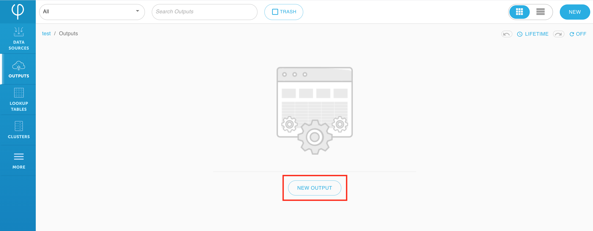

# Quick guide: Athena data output




If you haven’t signed up for Upsolver, follow the guides to [deploy Upsolver](../../../../getting-started/start-using-upsolver/upsolver-deployment-guide.md) and [create an Amazon AWS S3 data source](../../../../connecting-data-sources/amazon-aws-data-sources/amazon-s3-data-source/quick-guide-s3-data-source-1.md) first.


Upsolver supports sending data to various data outputs including but not limited to:

* Amazon Athena
* Amazon RedShift Spectrum
* Upsolver
* Amazon RedShift
* MySQL
* Elasticsearch
* Amazon S3
* HDFS
* Google storage
* Microsoft Azure storage
* Qubole
* Amazon SageMaker
* Lookup table
* Amazon Kinesis
* Kafka
* Snowflake

This guide provides a very simple data output without any complex transformations from the data source. However, Upsolver has many powerful transformation features; future guides will go over each feature in detail.

## Create a new data output

1. Create a new data output by clicking on **Output** and **New Output**.



2. Select **Amazon Athena** as your output type.


3. Provide a name for the data output. In this case, we will use the name `covid_data_demo_athena`. Make sure it’s mapped to an existing data source; then click **Next**.


4. Choose the columns that you want to output to Athena. By clicking on the plus iconnext to the field name. 

Add the following columns: 

* `aged_70_older` 
* `continent` 
* `date` 
* `new_cases`
* `population` 



There are many powerful capabilities available such as **aggregations**, **filters**, **calculations**, **lookup tables for joining**, ****and more. These features will be covered on a later guide. 


5. Click **Preview** to check that the output data is as expected, then click **Run**.


6. Make sure an existing Athena database is available for the output. If not, create a new database. 


7. Fill out the Athena database and table information for output then click **Next**.


8. Choose the time period for the data that you want to load then click Deploy.


## Access your data in Athena

1. Verify a table was automatically created under the database and table name defined previously in step 7.


2. Run the following query in Athena. The query shows the number of seniors from each continent according to the data set. 

```sql
SELECT COUNT(aged_70_older) AS number_of_seniors, continent, new cases
FROM <your table name>
GROUP BY continent, new_cases
ORDER BY new_cases DESC;
```


Success! Congratulations, you have created your first Upsolver data output.



## What’s next?

This guide provides a very simple output without complex transformations from the source. Check out our next guide to learn more about Upsolver's powerful transformation features:



