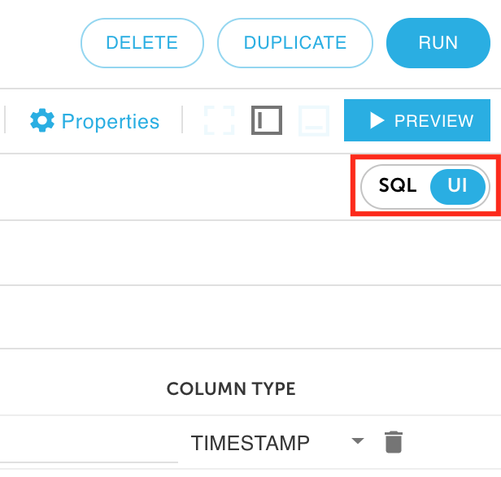

# Upsert data to Snowflake




Before we start, you must have already [deployed Upsolver](../../../../getting-started/start-using-upsolver/upsolver-deployment-guide.md) and [created data sources](../../../../connecting-data-sources/amazon-aws-data-sources/amazon-s3-data-source/quick-guide-s3-data-source-1.md).


Upsolver can load data into many databases including Snowflake. This guide creates a Snowflake data output. It uses a key to perform Upsert to a table. This feature can be used for loading CDC data to Snowflake database.

This guide uses an example where the **existing Snowflake table** has the following data.

| Key | Value |
| :--- | :--- |
| 1 | johnny |
| 2 | joey |
| 3 | deedee |
| 4 | tommy |


The new data source has a different value for **key 4**.


| Key | Value |
| :--- | :--- |
| 1 | johnny |
| 2 | joey |
| 3 | deedee |
| 4 | **marky** |

Now let’s take a look at how Upsert works in Upsolver.

## Create a Snowflake data output

1. Click on **Outputs** on the left and then click **New** on the right upper corner.

2. **Select** Snowflake as your data output.

3. Give your data output a **name**. Define your **Data Sources** and select whether is a **new table** or an **existing table**. 


**Note:** This example Upserts to an existing table. 


4. Click **Next.**

5. Under **Snowflake Connection**, select **Create a new Snowflake Connection**.

6. Fill out the **connection string** for Snowflake. Also enter your Snowflake **user name** and **password**. Provide a **name** for this output connection. Click **Create**.


**See:** [Snowflake connection](../../../../administration/connections/snowflake-connection.md) for more details regarding how to configure your Snowflake connection.


7. Provide details for your Snowflake environment including Snowflake **schema** and **table name**. Provide an **intermediate storage location** for data to be stored before merging to a Snowflake table. Click **Next**.

## Define the key for Upsert

1. Select the SQL window from the upper right hand corner. Keep in mind that everything that you do on the UI will be reflected in SQL and vice versa. 

2. The sample SQL uses the **`REPLACE ON DUPLICATE data.key`** statement to perform the Upsert.

3. Click **Run** in the upper right hand corner.

4. Choose the **compute cluster** and the time range that you wish to load your data from, then click **Deploy**.

5. Wait for a moment for the data to output to Snowflake.

## Verify the CDC Snowflake data output

#### Before Upsert:

#### After Upsert:

