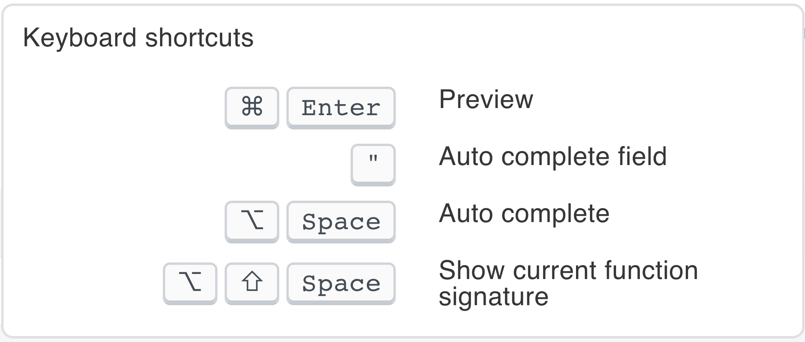
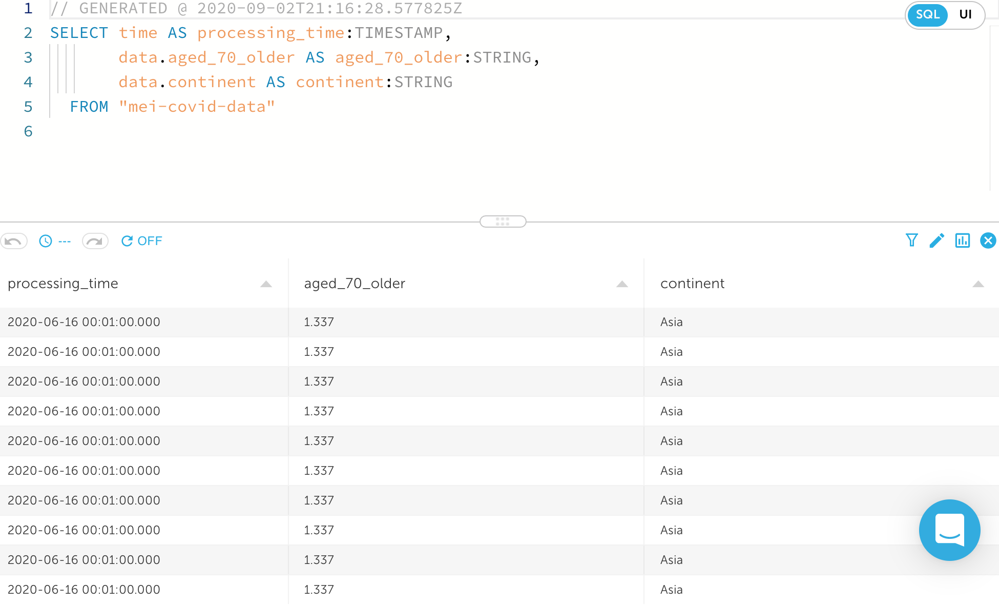
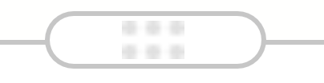

# Modify an output in SQL

When creating or editing an output, toggle from **UI** to **SQL** in order to directly modify the output through SQL.

To change the SQL page view, click the required button to view more or fewer panes. 

## Edit the output in SQL

Toggling to the SQL view will show you your current output as a SQL query. You can edit this directly to change the output as desired.


**See:** [Transform with SQL](../../transform-with-sql/) for more information on syntax.


When you click inside the SQL code, your current cursor position is updated.

You can also increase or decrease the font size to make it easier to edit and hover over the question mark iconto view the available keyboard shortcuts.

## Preview

The **Preview** pane allows you to create various “snapshots” of the output SQL and enables you to try different SQL queries until you find the one that you want.

* Click and drag the grip iconto view more or less of the **Preview** pane.
* Click the chart iconto view the events graph.
* Click the filter iconto add or remove filters from your preview.


**Note:** Filters can be directly typed into the SQL code and be previewed.  
**See:** [Filter using `WHERE`](../../transform-with-sql/transforming-data-with-sql.md#filter-a-stream-using-the-where-clause)\`\`

Alternatively, they can be added through the UI.  
**See:** [Add filters](../adding-filters.md)


