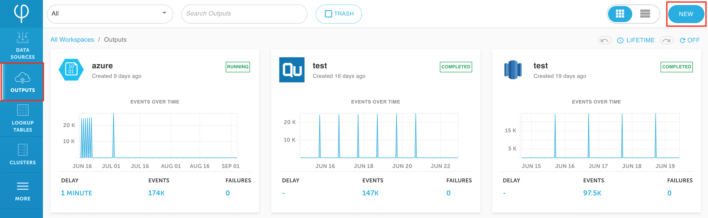
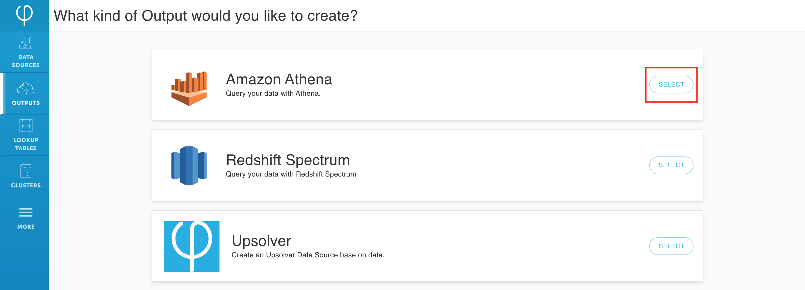

# Quick guide: SQL data transformation




Before starting to transform your data, you must have already [deployed Upsolver](../../../../getting-started/start-using-upsolver/upsolver-deployment-guide.md) and [created a data source.](../../../../connecting-data-sources/amazon-aws-data-sources/amazon-s3-data-source/quick-guide-s3-data-source-1.md)


Upsolver’s SQL transformation on data streams removes the complexity from traditional data pipeline transformations and orchestrations. 

Upsolver SQL is ANSI SQL compliant, so you don’t have to learn any special syntax to get started; it is intuitive and easy to use for anyone with basic SQL knowledge. Users write regular SQL expressions with extensions for streaming data use cases such as window aggregations, and the Upsolver engine will continuously execute the queries.

Let’s get started.

## Create an AWS Athena data output

1. Click on **Outputs** on the left and then **New** on the right upper corner.

2. **Select** Amazon Athena as the data output.

3. Give the data output a **name** and select your **data sources**; then click **Next**.

## Data transformation using SQL

1. Map your input fields to output fields by click on the add iconnext to the field. Alternatively, go directly to the SQL page and select your fields there. 


Keep in mind that everything written in SQL will be automatically translated in the UI and everything changed in the UI will be reflected in SQL.


2. Use **`TO_DATE`** function to parse out the **`YEAR()`** and **`MONTH()`** from the **`DATE STRING`**.

3. Use **`TO_NUMBER`** to convert **`STRING`** to **`NUMBER`** for calculation.

4. Use **`||`** to concatenate values from two fields together.

5. Click **Preview** to ensure that your data looks correct.

6. Click **Run** and input your AWS Athena information.

## Configure AWS Athena run parameter and data output information

1. Enter the **S3 Storage** that the Athena table will be utilizing, then enter in the **Connection**, **Database**, and **Table** information for your target Athena environment. Click **Next**.

2. Enter the run parameters for your data set. Pick the **compute cluster** you wish to utilize and the **time interval** for the data to be loaded to Athena. Click **Deploy**.

3. Monitor **Current Status** and wait until the data competes loading.

## Verify loaded data from AWS Athena

1. In your Athena environment, make sure the table is created correctly and data types are as expected.

2. Run a simple **Select** query to make sure the data loaded to Athena correctly.

## What’s next?



