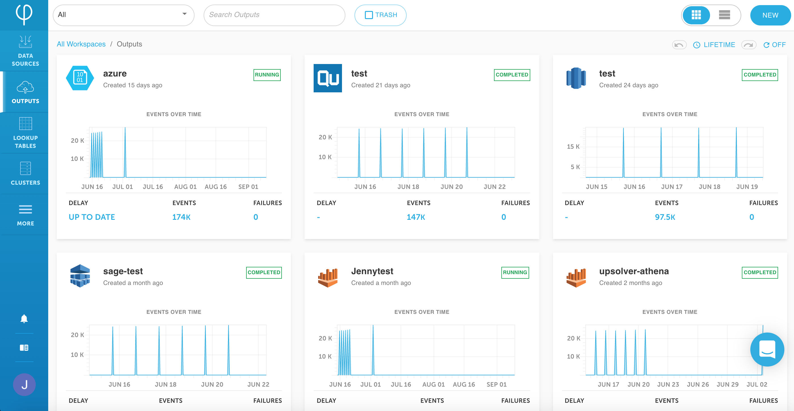
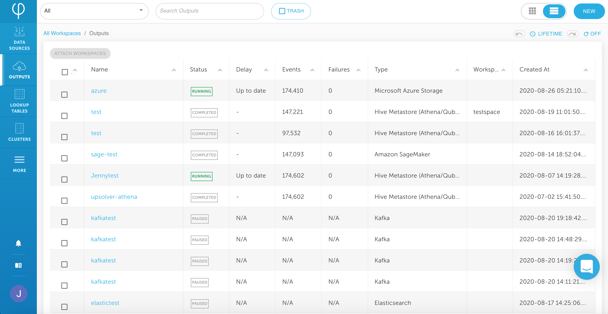
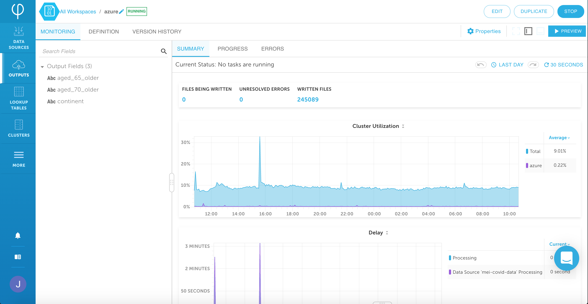

# View outputs

The **Outputs** page can be toggled to display your outputs in either a grid or list view. At the top, you can either filter the outputs according to its data source or search for outputs by name.

In the grid view, each output panel shows you the name of the output, when it was created, and its current status \(e.g. **Running**, **Paused**, **New**, **Draft**, etc.\). Beneath that is a graph of the output's events over time. At the bottom you can find the delay, number of events, and number of failures.

With the list view, you can sort the outputs according to their name, status, delay, events, failures, types, workspaces, and creation time.

You can click on a specific output to review its properties as well as monitor its progress and errors.

Additionally, the **Definition** tab will allow you to review the schema of your output along with any calculated fields or filters it may contain.

The **Version History** tab tracks the different versions of this output that may have been created \(if it is edited or duplicated\).

