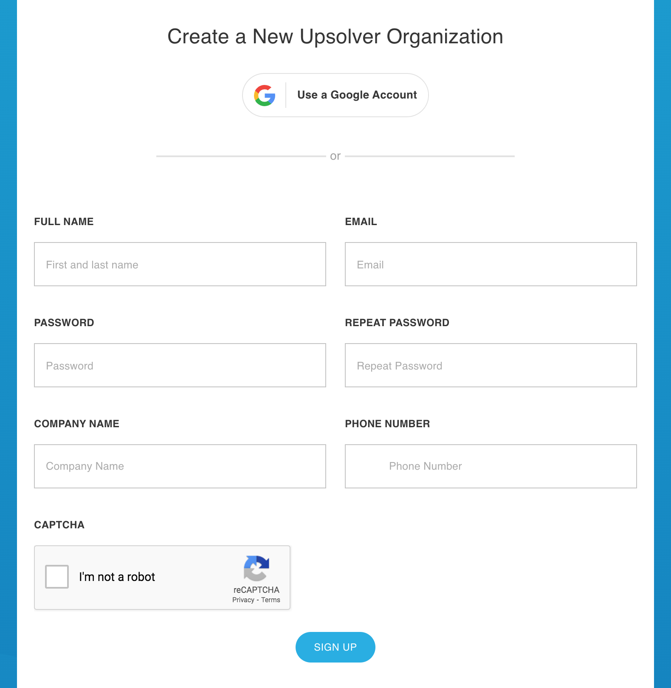
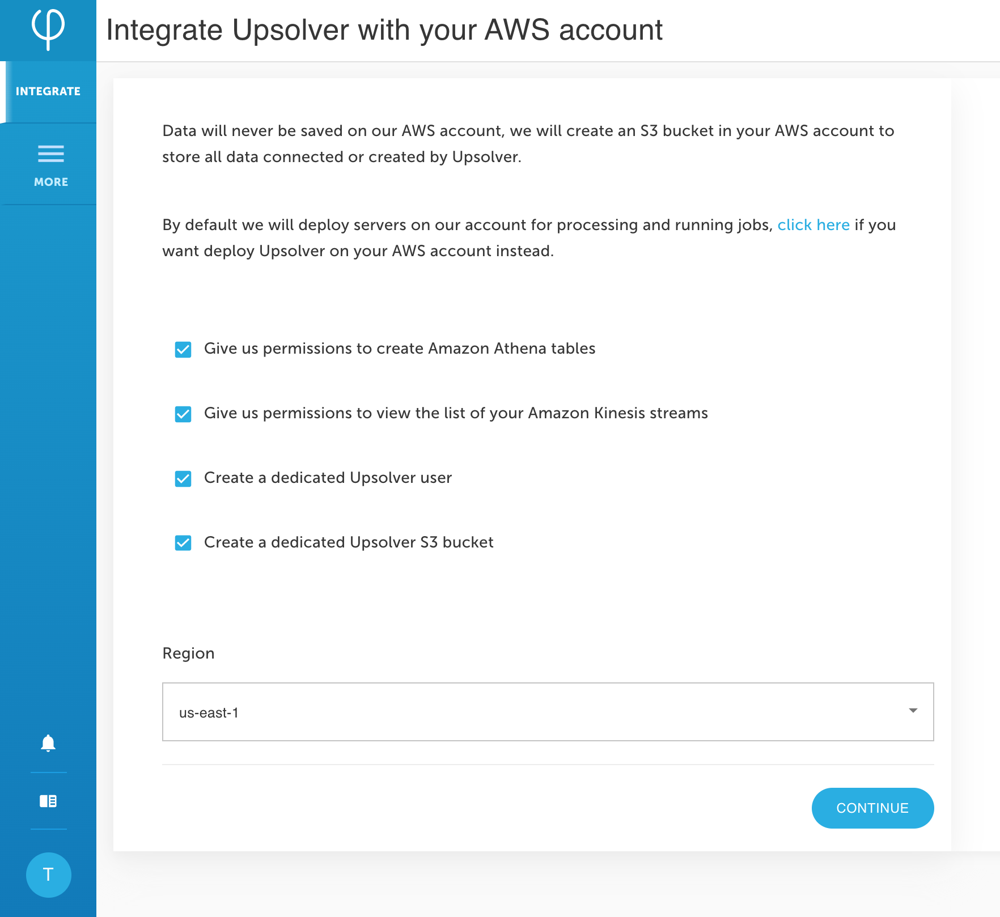
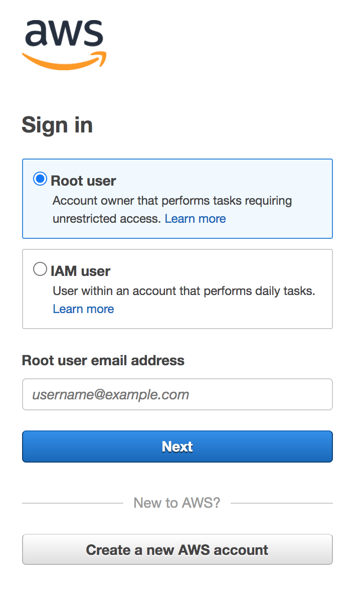

# AWS integration



To get to know Upsolver, you can try it out for [**FREE**](https://app.upsolver.com/signup). 

Upsolver supports many deployment models that suit your needs; this guide describes the fully managed option. 


**See:** [Deploy Upsolver on your AWS account](integrating-upsolver-on-your-aws-account.md) to learn more about deploying Upsolver in your own VPC.


Upsolver uses S3 storage resources in your AWS account. During the sign-up process you will need to grant Upsolver privileges to access your AWS account and create an S3 bucket. When you register for a demo, you can request credit for free AWS resources if you qualify for a POC. 

## Create an organization from the signup page

1. On the Upsolver website, click [Start a Trial](https://app.upsolver.com/signup). You can also deploy Upsolver directly from the [Amazon AWS Marketplace](https://aws.amazon.com/marketplace/pp/B07T8JDQ57?ref_=srh_res_product_title).


The Upsolver trial is free for 14-days and it includes access to all production features for workloads at any scale \(full production data\). 

You can request a fully-funded POC [here](https://www.upsolver.com/upsolver-poc-lp).


2. You will see the following registration form.

3. Fill in this registration form.

4. Click on **Sign Up**. Your trial will be valid for 14 days. 

5. Once signed up, you will be prompted to integrate Upsolver with your AWS account.

## Pre-integration requirements

1. Now that you are logged into an Upsolver organization, click on **Continue**. 


Upsolver uses S3 storage resources in your AWS account, so it will bring you to the Amazon AWS login page for integration.


2. Make sure you have administrator permissions for your AWS account. 


If you don’t have administrator permissions, you may send the page to your AWS administrator by clicking on [**Send This Page**](../try-upsolver.md#send-this-page).


## Integrate with your AWS environment

1. Click **Continue** and a CloudFormation page will open up in a new tab. 

2. Create the AWS environment for Upsolver integration by running a CloudFormation template. Check the **I acknowledge** statement at the bottom of the page and click on **Create stack**. 


This should take about one minute to complete. Once it is done, you should see that the CloudFormation stacks' status is `CREATE_COMPLETE`.


3. Click on **Done**. You should see the page where you can create a data source.

## What’s next?



