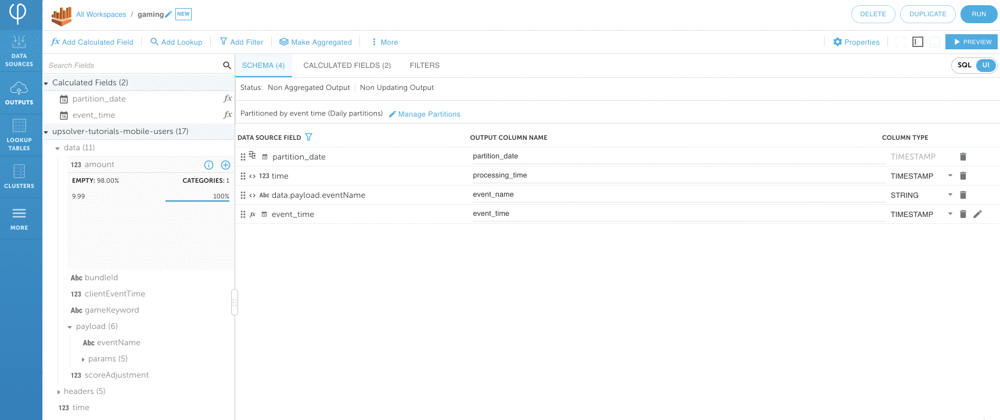
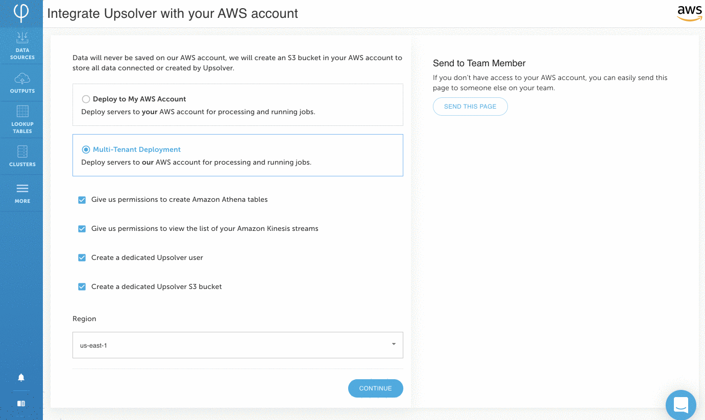

# Amazon Athena data output

To help you get started with Upsolver, you can try it out for free. You can choose between [**Upsolver Dedicated Compute**](https://app.upsolver.com/signup) ****and [**Community**](https://app.upsolver.com/signup/free) subscriptions. Both options give you free Upsolver units \(UUs\), units of processing capability per hour based on VM instance type.

## Prerequisite

1. An existing AWS environment to output your data to
2. Appropriate permissions to output to an Amazon Athena environment
3. Have an Athena environment set up. If not, follow [these instructions](https://docs.aws.amazon.com/athena/latest/ug/getting-started.html).

## Create a data source

1. Click on **DATA SOURCES &gt; NEW** to connect to various data sources. Upsolver works with both streaming and static data sources. We're using sample mobile gaming data for this tutorial.


2. Click on **SELECT** next to **Amazon S3** data source. There are many data sources to choose from. The Quickstart uses _pre-populated_ mobile data.


3. Choose **BUCKET &gt;** **upsolver-tutorials-mobile-users** by clicking on the dropdown box.  Fill in **FOLDER &gt; data** and **DATE PATTERN &gt; yyyy/MM/dd/HH/** click on **CONTINUE**. Upsolver automatically verifies the files in the bucket and displays blue checkmarks next to the file name.


4. Upsolver automatically parses the data and displays a sample of the data that you’re working with. You can expand each record to view each event in a formatted view.


5. Click on **CREATE** to complete the Amazon S3 Data Source. Notice the schema is automatically generated and data statistics are also displayed.


##  **Create a data output**

1. Click on **NEW OUTPUT** on the upper right corner. \(You can also get to the output screen by clicking on OUTPUTS &gt; NEW\)


2. Choose **Amazon Athena** output by clicking on **SELECT**. We’re going to use Amazon Athena as our output for this tutorial. You can output to any Upsolver data outputs. 


3. Enter **gaming** as the name of the output. Leave everything as default and click on **NEXT**.


4. Expand **payload** on the left hand side. Add a field to your output by clicking on the **+** sign next to the fields. The field that we’re adding is **data.payload.eventName**


## **Data transformation**

1. Rename the fields by clicking on the field under **OUTPUT COLUMN NAME** and rename **payload.eventname** to **event\_name**


2. Transform **data.clientEventTime** to from unix epoch to human readable UTC format. Click on **Add Calculated Field** on the upper left. 


3. Find the **TO\_DATE** function then click on **SELECT**. Note that each function has usage examples displayed on the right.


4. Enter **data.clientEventTime** in the **DATETIME** box and give the field a **NAME** called **event\_time**. 


5. Click on **PREVIEW** to make sure the date looks right and click on **SAVE**.


6. We're going to do a simple aggregation by adding the count of events for a given time. Click over to the **SQL tab** on the upper right hand corner. Keep in mind all changes that are made in the SQL view will also be represented in the UI view and vice-versa. 



7. Copy/paste **2 lines of SQL to the statement** \(see **line 8 and 10** below\) to the generated SQL statement and click on **PREVIEW** to ensure data looks correct.

```sql
SET partition_date = UNIX_EPOCH_TO_DATE(time);
SET event_time = UNIX_EPOCH_TO_DATE(data.clientEventTime);
// GENERATED @ 2020-11-16T01:32:29.510858Z
SELECT PARTITION_TIME(partition_date) AS partition_date:TIMESTAMP,
       time AS processing_time:TIMESTAMP,
       data.payload.eventName AS event_name:STRING,
       event_time AS event_time:TIMESTAMP,
       count(*) as event_count:DOUBLE
  FROM "upsolver-tutorials-mobile-users"
  GROUP BY event_time, partition_time(partition_date), time, data.payload.eventName
```


You may change the way data is partitioned by clicking on **Manage Partitions &gt; Partition by time**. Select **Partition Field &gt; event\_time** and choose the way you want to data to be partitioned. 


## **Connect to Amazon Athena and start streaming**

1. Click on **RUN** on the upper right corner**.** Create a new connection to Amazon Athena by choosing **CONNECTION &gt; Create your first Amazon Athena Connection**.


2.  Make sure you're logged in your Amazon AWS account for the following steps.


Outputting to Amazon Athena requires Upsolver to integrate with your account. If you don't have an environment available, you can try the [MySQL output ](mysql-data-output-option.md)and write to your own local environment.


Click on **INTEGRATE** and make sure you're logged in to your AWS account. For your privacy, Upsolver does not host your data.


3. Choose the **Multi-Tenant Deployment** option. Leave everything as default and click on **CONTINUE**. 


Upsolver has many deployment models. For this quick exercise, we're going to deploy it as a fully managed service. You can also easily deploy Upsolver in your private VPC. For more information, click [here](../../upsolver-concepts/deployment-models.md). Make sure you have the right permission. You can click on **SEND THIS PAGE** to provide the integration information to your cloud administrators if you do not have the right permission.



4. If you haven't logged in your AWS account, make sure you are logged in now. It will bring you to the CloudFormation stacks page for the integration. Check the **acknowledge** box and click on **Create stack**. 


The integration should table about 1 minute. and you will see **CREATE\_COMPLETE**. 


5. Switch back to your Upsolver environment and click on **DONE**. 


5. Click on **DATA OUTPUT &gt; gaming &gt; RUN.**



6. Select **S3 STORAGE &gt; S3 Default Output Storage** and **Connection &gt; Athena** Choose the **DATABASE NAME &gt; default** that you want the table to reside. Give the table a name **TABLE NAME &gt; gaming** Click on **NEXT**.


  
7. Use the **slide bar** to select the data from the **last day**. Keep ENDING AT as Never to ensure that the data is continuously being streamed to the table. Click on **DEPLOY**.


8. Upsolver starts outputting the data to Amazon Athena. Wait for the data to write to the Amazon Athena table. This might take several minutes. You can keep track of progress under the **PROGRESS** tab. You should be able to start querying your data in a few minutes.


The free version offers limited processing power. If you're trying to output faster or a larger amount of data, please [contact](https://www.upsolver.com/contact) Upsolver to increase Upsolver Units.



## **Verify your data in Amazon Athena**


