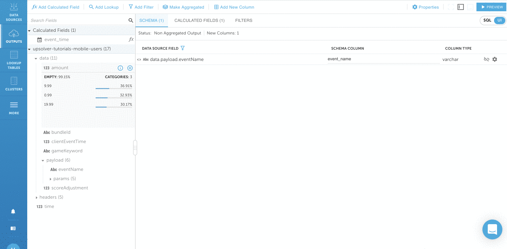

# Local MySQL data output option

## \*\*\*\*

1. Click on **NEW OUTPUT** on the upper right corner. \(You can also get to the output screen by clicking on OUTPUTS &gt; NEW\)


2. Choose **MySQL** output by clicking on **SELECT**. We’re going to use MySQL as our output for this tutorial. You can output to any Upsolver data outputs. 


3. Enter **gaming** as the name of the output. Leave everything as default and click on **NEXT**.


4. Add a field to your output by clicking on the **+** sign next to the fields. The field that we’re adding is data.payload.**eventName**


## **Data transformation**

1. Rename the fields by clicking on the field under **SCHEMA COLUMN** and rename **payload.eventname** to **event\_name**


2. Transform data.clientEventTime to from unix epoch to human readable format. Click on **Add Calculated Field** on the upper left and find the **TO\_DATE** function click on **SELECT**. Enter **data.clientEventTime** in the **DATETIME** box and give the field a **NAME** called **event\_time**. Click on **PREVIEW** to make sure the date looks right and click on **SAVE**.


**3.** Add a count for each event by clicking on **Make Aggregated &gt; OK &gt; Add Aggregation**. Click on **SELECT** next to **COUNT \(\*\)**  and click on **SAVE**.




Click over to the **SQL tab** on the upper right hand corner. Keep in mind all changes that are made in the SQL view will also be represented in the UI view and vice-versa. You can see the work from the UI automatically generated a SELECT statement. Click on **PREVIEW** to ensure data looks correct.


## **Connect to MySQL and start streaming**

1. Click on **RUN** on the upper right corner and choose **Create a new MySQL Connection** from the **MySQL Connection** dropdown.


2.  \(Optional\) Setup a local MySQL environment if you don’t have an existing environment.


If you don’t have an existing MySQL connection, you can install it locally on your computer: [download](https://dev.mysql.com/downloads/mysql/) and install the [MySQL Community Edition](https://dev.mysql.com/downloads/mysql/). Optionally, you can also download [MySQL workbench](https://dev.mysql.com/downloads/workbench/) as well. Keep in mind that other outputs will require integrations with your own AWS environment. 


* Run the following commands in your MySQL environment.

```bash
SET GLOBAL local_infile=1;
CREATE database dev;
```

* After MySQL is running locally, use [ngrok](https://dashboard.ngrok.com/get-started/setup) to  start a TCP tunnel forwarding to your local port 3306 by running `./ngrok tcp 3306` You will have the forwarding information below:


3. Define MySQL Connection in the following format \(include the ngrok forwarding url from above\) and click on **CREATE**

* **CONNECTION STRING:** `jdbc:mysql://2.tcp.ngrok.io:13763/dev?useUnicode=true&useJDBCCompliantTimezoneShift=true&useLegacyDatetimeCode=false&serverTimezone=UTC`
* **USER NAME: `root`**
* **PASSWORD: `<mysql password>`**
* **NAME: `mysql-local`**


4. Select the connection that you just defined as **MYSQL CONNECTION.** Choose **dev** under **SCHEMA** and **gaming** as **TABLE NAME.** Select **Default Storage Connection** as the **INTERMEDIATE STORAGE LOCATION** and click on **NEXT**.


5. Choose the **COMPUTE CLUSTER** and only load from the data from last 3 days click on **DEPLOY**. Click on OK if a warning appears.  


5. Upsolver starts outputting the data to MySQL. Wait for a moment for the data to output.


## **Verify your data in MySQL**


