# Upsolver Quickstart in 10 Minutes

## Welcome to Upsolver!

When you first log into Upsolver's [free Community Edition](https://app.upsolver.com/signup/free), you will see a link to this guide. It provides you with a quick tour of Upsolver. 


## About this guide

This guide is divided into two major sections. You may take a tour of both sections or directly create an Open Lake Data Output and start transforming data.

1. [View only guide](https://docs.upsolver.com/upsolver-1/getting-started/start-using-upsolver/upsolver-in-10-minutes/upsolver-quickstart-in-10-minutes#explore-pre-defined-queries-data-source-and-data-output-view-only)
2. [Try it yourself guide](https://docs.upsolver.com/upsolver-1/getting-started/start-using-upsolver/upsolver-in-10-minutes/upsolver-quickstart-in-10-minutes#process-data-with-open-lake-data-output-try-it-yourself)

The sample environment provides you with a pre-created[ ](../../../connecting-data-sources/amazon-aws-data-sources/amazon-s3-data-source/quick-guide-s3-data-source-1.md)[Data Source ](../../../connecting-data-sources/amazon-aws-data-sources/amazon-s3-data-source/quick-guide-s3-data-source-1.md)that continuously parses data from an Amazon S3 bucket. 

The sample Open Lake data output transforms the data and users can query the transformed data with SQL. 


The [free Community Edition](https://app.upsolver.com/signup/free) offers limited compute. [Contact Upsolver f](https://www.upsolver.com/schedule-demo)or more compute resources. 


## Explore pre-defined queries, data source and data output \(view only\)

### Run sample queries


Upsolver provides you with a pre-populated worksheet that runs queries using Open Lake query engine. Click on **Explore the Quickstart Worksheet** to get started!


The following SQL is querying data from `orders` table that's being continuously populated from Upsolver Amazon S3 data source called _**Upsolver Tutorial Orders Bucket**_ 



```sql
-- This sample query provides the total amount for each order. The data is streaming in from a S3 bucket
-- We pre-created a data source called "Upsolver Tutorial Orders Bucket". You may explore the sample
-- data source by click on DATA SOURCES on the menu bar and "Upsolver Tutorial Orders Bucket"
-- Upsolver automatically parses the data and provides data demographics and statistics information 
-- We have also created a sample data output that writes to the orders table used by this query. 
-- You may explore the existing data output by clicking on DATA OUTPUT > Orders
-- If you're interested in creating your own data source or output, please integrate with your AWS account 
-- by clicking on DATA SOURCES > NEW 
-- Happy Upsolving! 

SELECT order_date,
         order_id,
         buyer_email,
         net_total,
         sales_tax,
         net_total + sales_tax as order_total
FROM upsolver.sample_data.orders
WHERE  event_type = 'ORDER'
GROUP BY  1,2,3,4,5,6 limit 10
```



```sql
-- This sample query provides the total order count for each day. The data is streaming in from a S3 bucket
-- We pre-created a data source called "Upsolver Tutorial Orders Bucket". You may explore the sample
-- data source by click on DATA SOURCES on the menu bar and "Upsolver Tutorial Orders Bucket"
-- Upsolver automatically parses the data and provides data demographics and statistics information 
-- We have also created a sample data output that writes to the orders table used by this query. 
-- You may explore the existing data output by clicking on DATA OUTPUT > Orders
-- If you're interested in creating your own data source or output, please integrate with your AWS account 
-- by clicking on DATA SOURCES > NEW 
-- Happy Upsolving! 

SELECT count(distinct order_id) as order_per_day,
         order_date
FROM upsolver.sample_data.orders
WHERE  event_type = 'ORDER'
GROUP BY  order_date
ORDER BY order_date DESC;
```



Click on **RUN** on the upper right hand corner to see results from these queries. 


### Explore sample data source


We have pre-created sample data sources used by the queries in the worksheets. You may explore the data sources by clicking on **DATA SOURCES &gt;  Upsolver Tutorial Order Bucket**

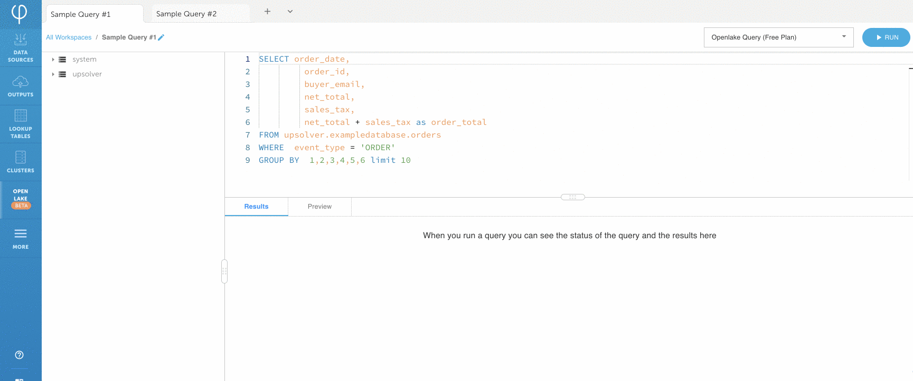

Upsolver parses data on read. It provides you with rich data demographics and statistics on each field. Upsolver supports all data formats and keeps an open format. 

A sample of the raw data from source can be viewed by clicking the **SAMPLES** tab.


Click on each field on the left \(automatically parsed and inferred by Upsolver\) to understand the statistics of your data.


Highlight **Events Over Time** to understand your events demographics.

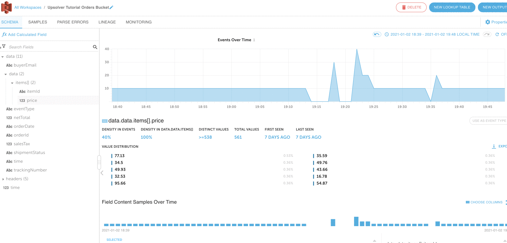

Click [here](../../../connecting-data-sources/data-source-ui-tour.md) to learn more about Upsolver's Data Sources UI.

### Sample data output


Now you might wonder - I have a data source, how do I transform my data and write to a table? We can take a look at the pre-built data output by clicking on **OUPUTS &gt; Orders &gt; DEFINITION**. Upsolver provides over _**200 built-in transformation functions**_ to allow you easily transform your raw data. You can explore these functions on your own by creating your own Open Lake data output. \(see next section\) For more information, please click [here](../../../data-outputs-and-data-transformation/data-outputs/).

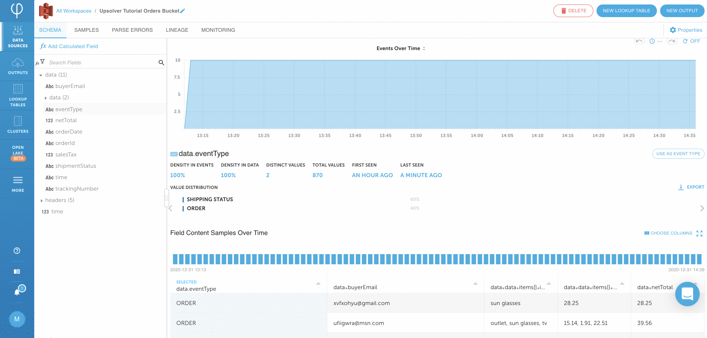

## Process data with Open Lake data output \(try it yourself\)

To learn more about Upsolver, let's create a Data Output together. Upsolver offers much more than this Quickstart. [Contact Upsolver ](https://www.upsolver.com/schedule-demo)for a demo or a free POC with more compute power.

### Create a Open Lake data output

1. Click on **DATA OUTPUTS &gt; NEW** and **SELECT** Open Lake.

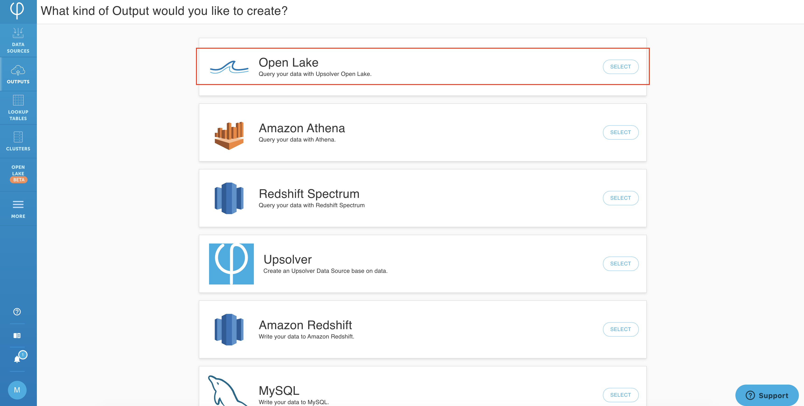

2. Give your output a NAME and select **Upsolver Tutorial Orders Bucket** as your **DATA SOURCES**. Leave the output option as **New** to create a new table in Open Lake. Click on **NEXT**.


### Add fields to your Open Lake output

Add the following fields to your output by clicking on the **+** sign next to each field. These fields were parsed automatically when the Data Source was created. Leave **data.netTotal** and **data.salesTax** as **DOUBLE** when you map these fields to the output.

```text
data.buyerEmail
data.orderId
data.netTotal
data.salesTax
```

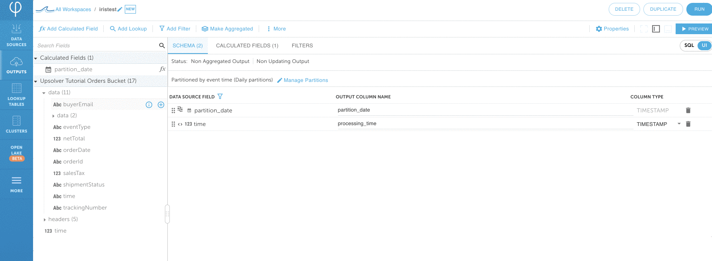

### Perform simple data transformations

1. You may use the UI or SQL to transform data. Changes will be automatically synced between the two interfaces. Let's start by transform orderDate to a TIMESTAMP format. Click on **Add Calculated Field**. Locate **TO\_DATE** function and click on **SELECT**. Under **DATETIME**, locate the **data.orderDate** field and give it a **NAME** as **order\_date**. click on **SAVE**. Notice that the calculated field is automatically added to your listed output fields as **data**.**order\_date** with TIMESTAMP data type.

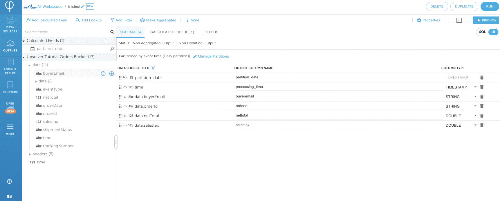

2. Let's use the SQL UI to add a simple calculation. Click over to the SQL tab. Notice that changes the UI are automatically translated in the SQL statement.

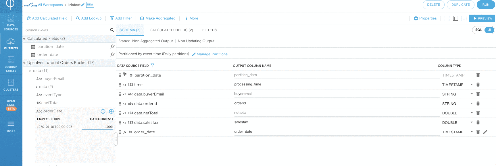

3. Add the following SQL to your pre-generated SQL statement \(note that this aggregation can also be easily performed in the UI instead of SQL\) `data.netTotal + data.salesTax as order_total`on line 11 and `WHERE data.eventType = 'ORDER'` at the end of the statement. The SQL will look like the following after adding the aggregations and filter.

```sql
SET partition_date = UNIX_EPOCH_TO_DATE(time);
SET order_date = TO_DATE(data.orderDate);
// GENERATED @ 2021-01-09T17:30:37.276673Z
SELECT PARTITION_TIME(partition_date) AS partition_date:TIMESTAMP,
       time AS processing_time:TIMESTAMP,
       data.buyerEmail AS buyeremail:STRING,
       data.orderId AS orderid:STRING,
       data.netTotal AS nettotal:DOUBLE,
       data.salesTax AS salestax:DOUBLE,
       order_date AS order_date:TIMESTAMP, 
       data.netTotal + data.salesTax as order_total //add this line
  FROM "Upsolver Tutorial Orders Bucket"  
      WHERE data.eventType = 'ORDER' //add this line
    
```

Click on **PREVIEW** to make sure the data is as expected.


4. Click back to your **UI** view and notice that everything you've changed in SQL is automatically reflected in the UI. Note: we're only scratching the surface of Upsolver data processing capabilities. Upsolver has hundreds of built-in functions to make data transformation simple.

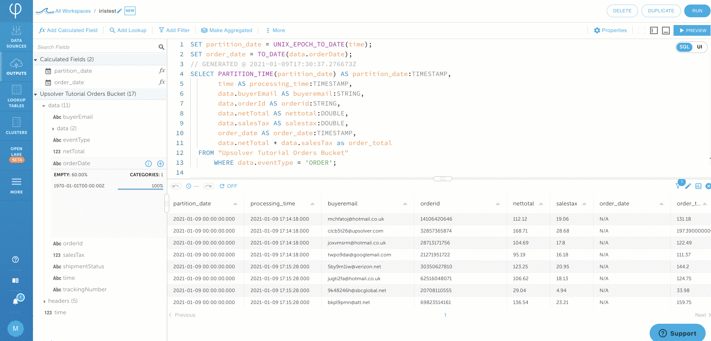

### Output processed data to Open Lake

1. Click on **RUN** on the upper right corner. Leave everything as its default values and provide a **TABLE NAME**. Click on **NEXT**.

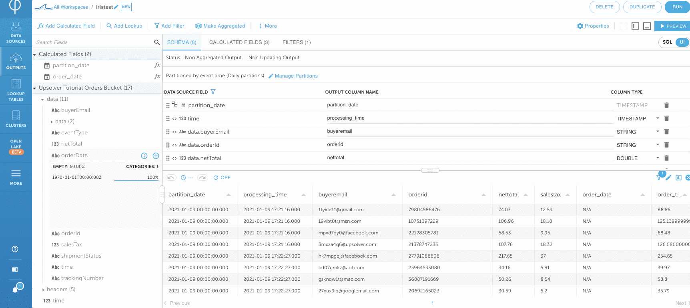

2. Use the slide bar to choose the time window you want to output your data from. The example shows the data from the past 12 hours. Optionally, you can leave **ENDING AT** as **Never** to continuously stream new data into your Open Lake table. 

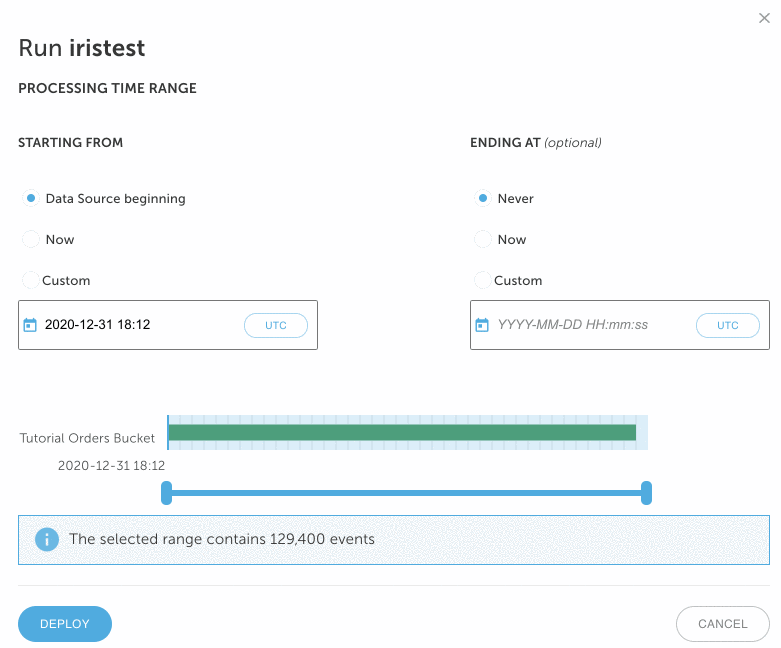

3. Click on **DEPLOY**. Click on the **PROGRESS** tab to monitor the Data Output status.

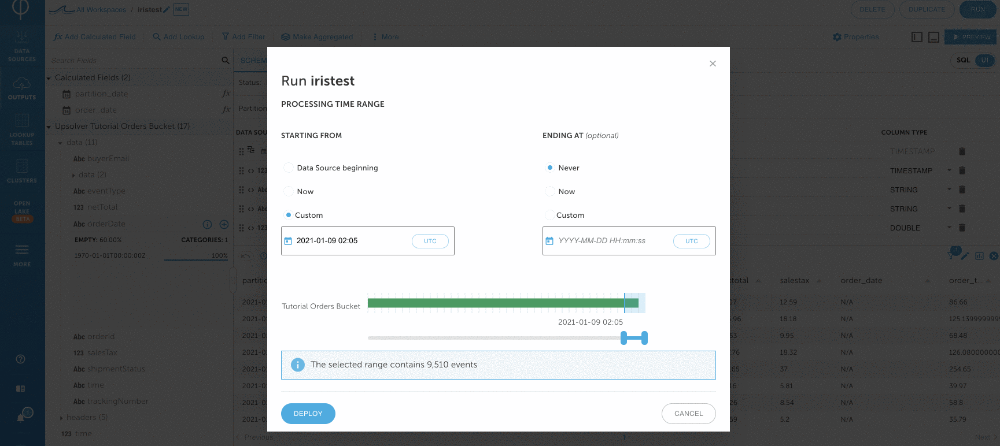

4. The output will take about _**2 minutes**_ to catchup to its current event. After the data is caught up under **PROGRESS**, click on **ERRORS** to make sure everything is successful. Click the **OPEN LAKE** icon on the left menu bar and run a sample query to make sure everything was written properly. e.g. `SELECT * FROM upsolver.sample_data.<your table name> LIMIT 100;`

#### Congratulations! You have taken a quick tour of Upsolver.[ Contact us ](https://www.upsolver.com/schedule-demo)to start your Upsolver journey. Happy Upsolving!

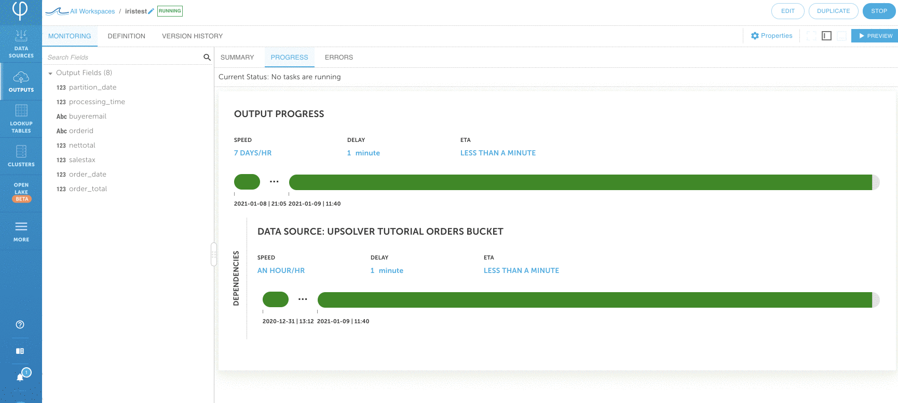

