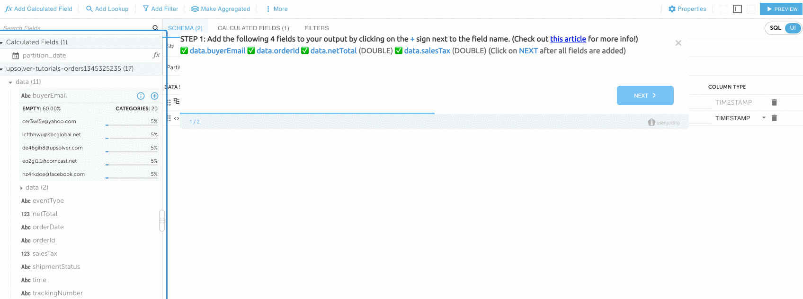
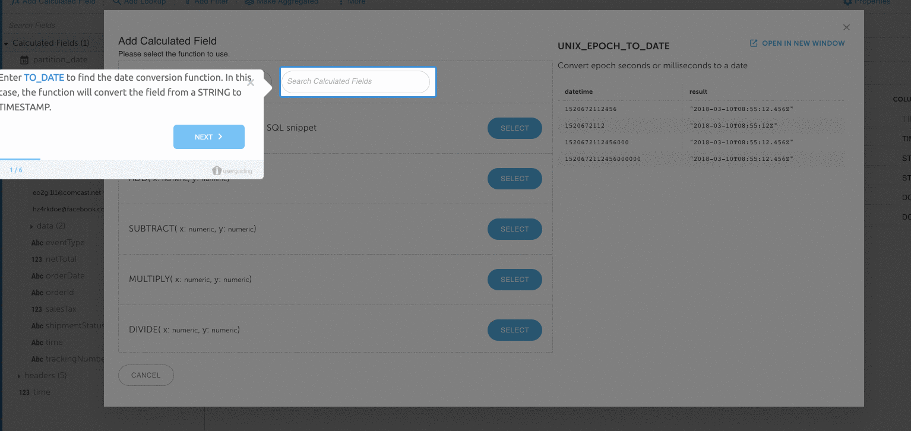
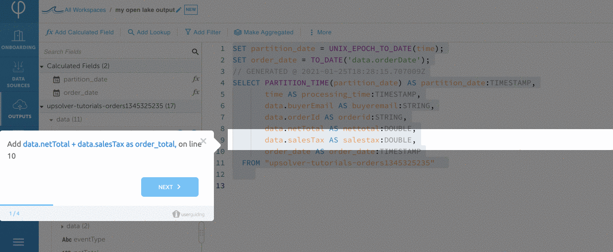
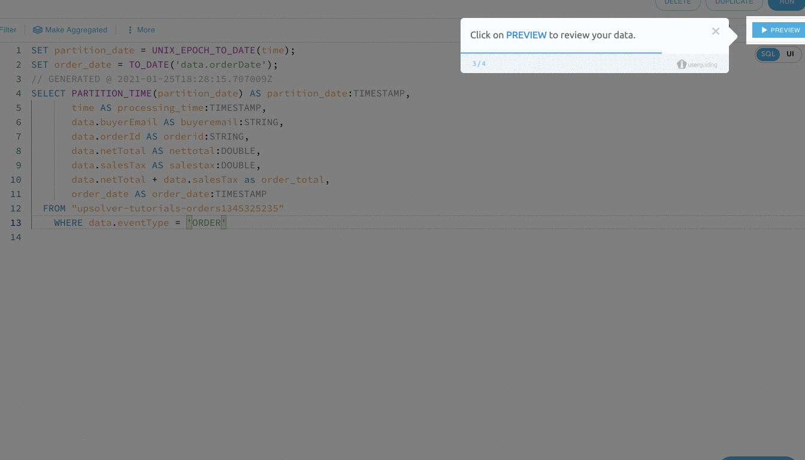
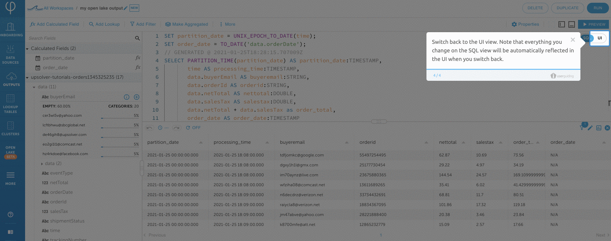
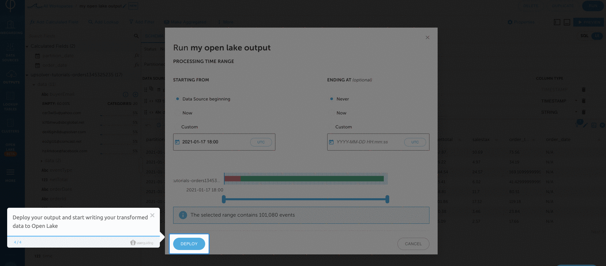
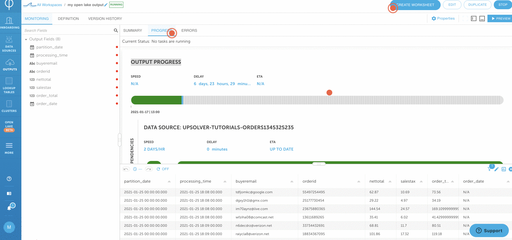

# Upsolver Quickstart in 10 Minutes

## Welcome to Upsolver!

When you first log into Upsolver's [free Community Edition](https://app.upsolver.com/signup/free), you will see a link to this guide. It provides you with a quick tour of Upsolver. 


## About this guide

The sample environment provides you with a pre-created[ ](../../../connecting-data-sources/amazon-aws-data-sources/amazon-s3-data-source/quick-guide-s3-data-source-1.md)[Data Source ](../../../connecting-data-sources/amazon-aws-data-sources/amazon-s3-data-source/quick-guide-s3-data-source-1.md)that continuously parses data from an Amazon S3 bucket. Upsolver transforms the data and users can query the transformed data with SQL. 


The [free Community Edition](https://app.upsolver.com/signup/free) offers limited compute. [Contact Upsolver f](https://www.upsolver.com/schedule-demo)or more compute resources. 


## Upsolver Quickstart

Welcome to Upsolver! After signing up and logging in the Community Edition, you will see the Quickstart's welcome screen. 

### Create a Data Source

1. Welcome screen: start your Upsolver journey by creating a Data Source. We have set up sample streaming data in an Amazon S3 bucket with new files constantly being written to the bucket. Note: Upsolver provides many built-in [Data Sources.](https://integ.upsolver.com/inputs/create)  Click **Create Data Source** to connect Upsolver to your data source.


2. Define data source bucket: select the Amazon S3 bucket that hosts where your data is located. Leave this option as the default value of **upsolver-tutorial-orders** Note: Upsolver supports all data formats. Click on **NEXT**.


3. Define data source format: Upsolver provides many options to parse your data. The Quickstart provides a subset of the options. Leave all values as default: `GLOBAL PATTERN` is set to `*`. It means Upsolver will parse everything in a S3 bucket. `DATE FORMAT` is `yyyy/MM/dd/HH`. This is how objects are stored in the folders. For example: `s3://upsolver-tutorial-orders/2021/01/16/15/35/<file_name>` 

You may see a sample of the files from defined bucket displayed on the right side of the screen. Optionally, you can identify the time you want to start ingesting from. We will **leave all values as default** and click on **NEXT**.


4. Preview sample data: Upsolver will display a sample of the data being parsed. You may click on each individual event to see a formatted record. Click on **CREATE**.


5. You have successfully created your first data source! 🎉 You will find a list of parsed fields on the left and data demographics and statistics as well. Click on each field to view the field's statistics.


Upsolver offers much more than this Quickstart. [Contact Upsolver ](https://www.upsolver.com/schedule-demo)for a demo or a free POC with more compute power.

### Create a Open Lake data output

1. Start creating the Open Lake Output: now we have a data source defined, click on **NEW OPEN LAKE OUTPUT** on the upper right hand corner to start transforming your data and output to Upsolver's Open Lake.


2. Define the Open Lake Output: provide the data output with a `NAME` and define the `DATA SOURCES(s) -`where the data come from. We will use the data source created in the previous section called `upsolver-tutorials-orders`. For this Quickstart, we will write to a new table in the Open Lake environment. Leave all values as **default** and click on **NEXT**.


### Add fields to your Open Lake output

1. Add the following fields to your output by clicking on the **+** sign next to each field. These fields were parsed automatically when the Data Source was created. Leave **data.netTotal** and **data.salesTax** as **DOUBLE** when you map these fields to the output.

```text
data.buyerEmail
data.orderId
data.netTotal (DOUBLE)
data.salesTax (DOUBLE)
```

This step also allows you to change the name and data type of your fields when you output to your target system. After adding the fields, click on **NEXT**.



2. Click on **Add Calculated Field** to perform a simple data transformation.


### Perform simple data transformations

Upsolver offers 200+ built-in transformations functions. You may use the UI or SQL to transform your data. Changes will be automatically synced between the two interfaces. **Let's start by transforming data.orderDate to a TIMESTAMP format.** 

1. Transform data.orderDate from a STRING to TIMESTAMP.

* Locate **TO\_DATE** function and click on **SELECT**
* Under **DATETIME**, locate the **data.orderDate** field and give it a **NAME** as **order\_date**. 
* click on **SAVE**. Notice that the calculated field is automatically added to your listed output fields as **data**.**order\_date** with TIMESTAMP data type.



2. We can use the **SQL UI** to add a simple calculation directly in SQL instead of using the UI. Click over to the SQL tab. Note: changes the UI are automatically translated in the SQL statement. Changes in the SQL statement will be automatically reflected in the UI.


3. This step uses the SQL UI to directly calculate the total for each order. Add the following SQL to your pre-generated SQL statement \(note that this aggregation can also be easily performed in the UI instead of SQL\) `data.netTotal + data.salesTax as order_total,`on line 10 and `WHERE data.eventType = 'ORDER'` at the end of the statement. The SQL will look like the following after adding the aggregations and filter.



Below is the full SQL statement for your reference.

```sql
SET partition_date = UNIX_EPOCH_TO_DATE(time);
SET order_date = TO_DATE('data.orderDate');
// GENERATED @ 2021-01-25T18:28:15.707009Z
SELECT PARTITION_TIME(partition_date) AS partition_date:TIMESTAMP,
       time AS processing_time:TIMESTAMP,
       data.buyerEmail AS buyeremail:STRING,
       data.orderId AS orderid:STRING,
       data.netTotal AS nettotal:DOUBLE,
       data.salesTax AS salestax:DOUBLE,
       data.netTotal + data.salesTax as order_total, //add this line
       order_date AS order_date:TIMESTAMP
  FROM "upsolver-tutorials-orders"  
  WHERE data.eventType = 'ORDER' //add this line
```

4. Click on **PREVIEW** to make sure the data is as expected.



4. Click back to your **UI** view. Note: everything you've changed in SQL is automatically reflected in the UI. We're only scratching the surface of Upsolver data processing capabilities. 



### Output processed data to Open Lake

1. Click on **RUN** on the upper right corner. Leave everything as its default values and provide a **TABLE NAME**. Click on **NEXT**.


2. Leave all the values as **default**. Note: you may use the slide bar to choose the time window you want to output your data from. Optionally, you can leave **ENDING AT** as **Never** to continuously stream new data into your Open Lake table. Click on **DEPLOY**.


3. Click on the **PROGRESS** tab to monitor the Data Output status. The output will take about _**1-2 minutes**_ to catchup to its current state. Wait for **OUTPUT PROGRESS** to start turning green.



4. The output will take about _**1-2 minutes**_ to catchup to its current event. After the data is caught up under **PROGRESS**, click on **ERRORS** to make sure everything is successful. 



### Explore transformed data in Open Lake worksheets

1. Click the **CREATE WORKSHEET** button on upper right hand corner to start exploring the data that you've transformed and written to a table.


2. Expand the **upsolver** catalog and choose the **sample\_data** schema. Click on the **&lt;table name&gt;** you've written to \(from the step 1\). You will see a sample of of your transformed data!


#### 🎉 Congratulations! You have taken a quick tour of Upsolver.[ Contact us ](https://www.upsolver.com/schedule-demo)to start your Upsolver journey. Happy Upsolving!

## Explore a pre-built data lake

### Run sample queries


Upsolver provides you with a pre-populated worksheet that runs queries using Open Lake query engine. Click on [**Explore the Quickstart Worksheet** ](https://integ.upsolver.com/openlake)to get started!

The following SQL is querying data from `orders` table that's being continuously populated from Upsolver Amazon S3 data source called [**Upsolver Tutorial Orders Bucket** ](https://integ.upsolver.com/inputs/list)\*\*\*\*



```sql
-- This sample query provides the total amount for each order. The data is streaming in from a S3 bucket
-- We pre-created a data source called "Upsolver Tutorial Orders Bucket". You may explore the sample
-- data source by click on DATA SOURCES on the menu bar and "Upsolver Tutorial Orders Bucket"
-- Upsolver automatically parses the data and provides data demographics and statistics information 
-- We have also created a sample data output that writes to the orders table used by this query. 
-- You may explore the existing data output by clicking on DATA OUTPUT > Orders
-- If you're interested in creating your own data source or output, please integrate with your AWS account 
-- by clicking on DATA SOURCES > NEW 
-- Happy Upsolving! 

SELECT order_date,
         order_id,
         buyer_email,
         net_total,
         sales_tax,
         net_total + sales_tax as order_total
FROM upsolver.sample_data.orders
WHERE  event_type = 'ORDER'
GROUP BY  1,2,3,4,5,6 limit 10
```



```sql
-- This sample query provides the total order count for each day. The data is streaming in from a S3 bucket
-- We pre-created a data source called "Upsolver Tutorial Orders Bucket". You may explore the sample
-- data source by click on DATA SOURCES on the menu bar and "Upsolver Tutorial Orders Bucket"
-- Upsolver automatically parses the data and provides data demographics and statistics information 
-- We have also created a sample data output that writes to the orders table used by this query. 
-- You may explore the existing data output by clicking on DATA OUTPUT > Orders
-- If you're interested in creating your own data source or output, please integrate with your AWS account 
-- by clicking on DATA SOURCES > NEW 
-- Happy Upsolving! 

SELECT count(distinct order_id) as order_per_day,
         order_date
FROM upsolver.sample_data.orders
WHERE  event_type = 'ORDER'
GROUP BY  order_date
ORDER BY order_date DESC;
```



Click on **RUN** on the upper right hand corner to see results from these queries. 


In the next section , we will take a look at the Upsolver Data Source that populates the Open Lake.

### Explore sample data source


We have pre-created sample data sources used by the queries in the worksheets. You may explore the data sources by clicking on **DATA SOURCES &gt;  Upsolver Tutorial Order Bucket**


Upsolver parses data on read. It provides you with rich data demographics and statistics on each field. Upsolver supports all data formats and keeps an open format. 

A sample of the raw data from source can be viewed by clicking the **SAMPLES** tab.


Click on each field on the left \(automatically parsed and inferred by Upsolver\) to understand the statistics of your data.


Highlight **Events Over Time** to understand your events demographics.


Click [here](../../../connecting-data-sources/data-source-ui-tour.md) to learn more about Upsolver's Data Sources UI. Next, we're going to create a Data Output and transform data from the data source.

