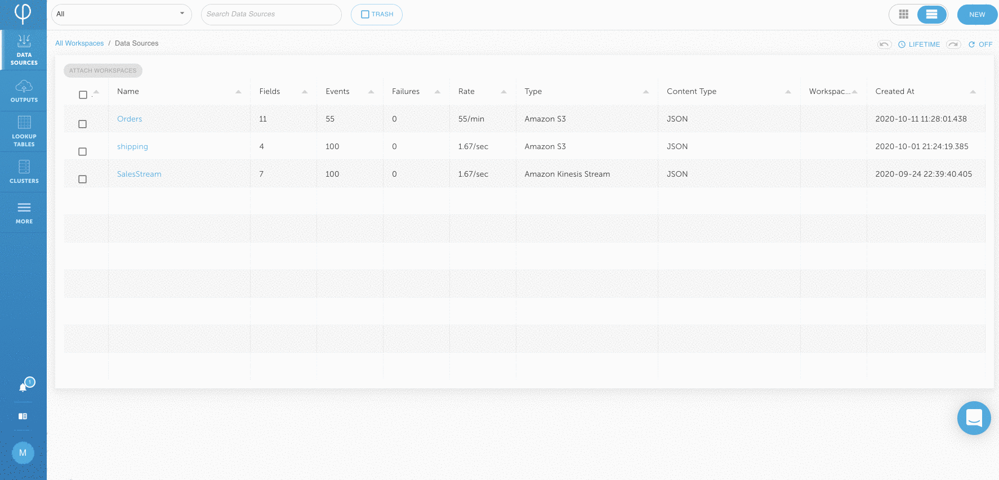
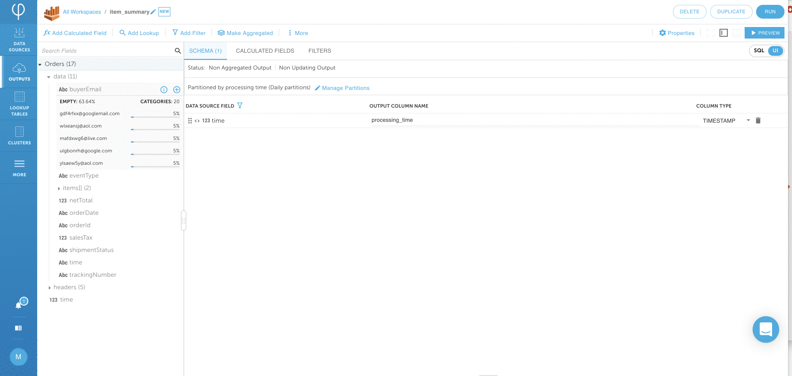
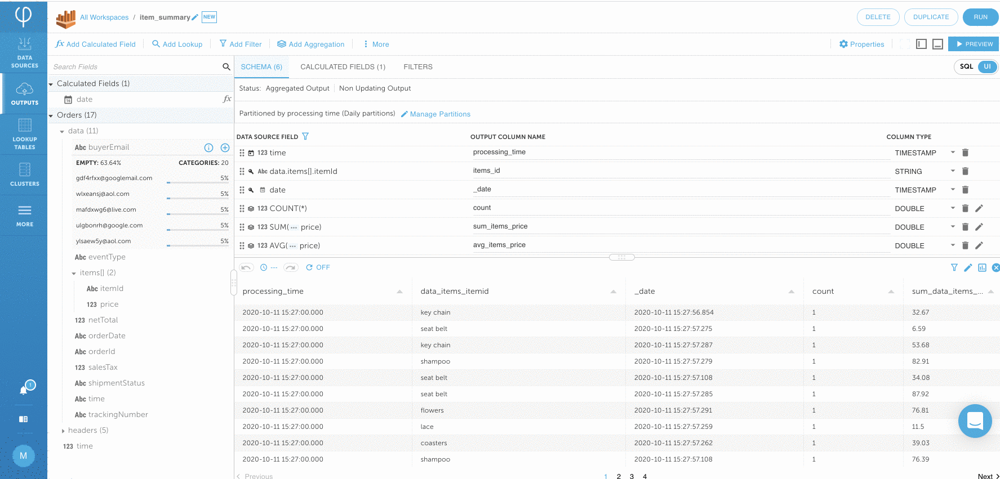
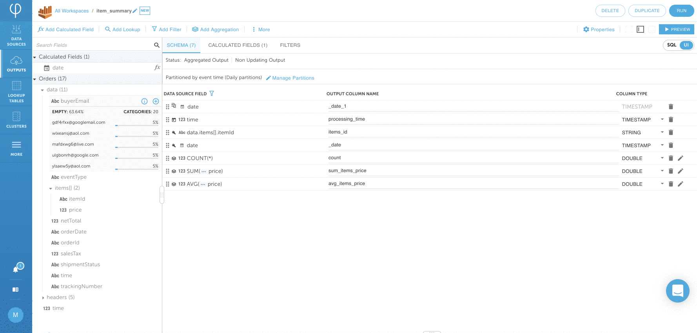

# Pre-aggregate data for efficiency and performance

Raw data can be very voluminous. Analysts might only need summarized data that's applicable to business.  By pre-aggregating the data as it is ingested, you’re able to improve query performance and minimize storage and compute costs.

The objective of this module is to create a summary table in Athena that contains the totals for each item sold for a given day.

Desired Output would be an **item\_summary** table with below schema:


## 1. Create an Amazon Athena data output

Click on **DATA OUTPUT &gt; NEW** and **SELECT** **Amazon Athena output.** Give the output a **NAME &gt; item\_summary** and choose **DATA SOURCES &gt; Orders** Click on **NEXT** to continue.



## 2. Add aggregation to the data stream

From the Upsolver Transformation Screen, add **Itemid** to the output by clicking the **+** sign next to the field. Then click **Make Aggregated**  Click **OK** if the warning pops-up.



Click on **Add Calculated Field**. Find and **SELECT** the **TO\_DATE** function. Enter **DATETIME &gt;** **data.orderDate** and **NAME &gt;** root**.date** Check the data by clicking on **PREVIEW**. If everything looks ok, click on **SAVE.**


  
Click on **Add Aggregation** Find and **SELECT** **COUNT\(\*\)** and click on **SAVE**. This will count the number of items for a given period of time window in a stream. Click away the warning if they appear.


Add another aggregation by clicking on **Add Aggregation** again. This time select **SUM** from the list and choose **data.items\[\].price** from the list. Click on **SAVE**. Dismiss any warnings that you may encounter.


Add the last aggregation by clicking on **Add Aggregation**. This time select **AVG** from the list and choose **data.items\[\].price** from the list. Click on **SAVE**. Dismiss any warnings that you may encounter.


## 3. Rename the fields to match the output schema

Change the output column names to  **data\_items\_itemid &gt; items\_id**  **sum\_data\_items\_price &gt; sum\_items\_price**, and **avg\_data\_items\_price &gt; avg\_items\_price** Be very careful renaming the fields, we will use them later.


## 4. Define the partition strategy for writing data to Amazon Athena


Proper partitioning strategy can significant improve query performance with Amazon Athena. Upsolver manages partitions and compactions automatically.


Click on **Manage Partitions** and choose **Time Partition Field &gt; date** and **Time Partition Size &gt; Daily** Click on **CLOSE**. You will see _Partitioned by event time \(Daily partitions\)_ shown on the screen instead of _processing time_.



## 5. Verify your SQL and data and define run parameter

Switch to the **SQL** view. Your SQL should look similar to the following. If your SQL looks different, copy and paste it to your environment. 

```sql
SET "date" = TO_DATE(data.orderDate);
// GENERATED @ 2020-10-12T04:13:03.089790Z
SELECT PARTITION_TIME("date") AS _date_1:TIMESTAMP,
       AGGREGATION_TIME() AS processing_time:TIMESTAMP,
       data.items[].itemId AS items_id:STRING,
       "date" AS _date:TIMESTAMP,
       COUNT(*) AS "count":DOUBLE,
       SUM(data.items[].price) AS sum_items_price:DOUBLE,
       AVG(data.items[].price) AS avg_items_price:DOUBLE
  FROM "Orders"  
    GROUP BY data.items[].itemId,
          "date",
          PARTITION_TIME("date")
    APPEND ON DUPLICATE

```

Click on **PREVIEW** to verify your data. Click on **RUN** to define the Amazon Athena. Choose the **DATABASE NAME &gt; upsolver** and **TABLE NAME &gt; item\_summary** Click on **NEXT**.



## 6. Start writing data to Amazon Athena and verify data

Leave everything on the Run page as default and click on **DEPLOY**. 


The output is continuous stream by leaving **ENDING AT** as **Never**, 



Upsolver starts writing data to Amazon Athena. You can click on **PROGRESS** to monitor output progress. This may take a minute.


## 7. Query item\_summary table for aggregated data


When Upsolver creates an upserting output to Athena, it creates two objects: a table with the suffice `_underlying_data` and a view with the output name.  When querying, you should query the VIEW, and not the underlying data.


Using Athena you can now query the data set created by Upsolver \(it may take a few minutes before the data is available\). Some sample queries that can be run are below: Click [here](https://console.aws.amazon.com/athena/home?force&region=us-east-1) to login to Athena in order to run below queries

```sql
// The number of each item sold

SELECT items_id,
         SUM("count")
FROM upsolver.item_summary
GROUP BY  items_id LIMIT 10
```


```sql
// The average price of the items

SELECT "_date",
         sum("sum_items_price")/sum("count") AS avg_price
FROM upsolver.item_summary
GROUP BY  "_date" LIMIT 10
```


