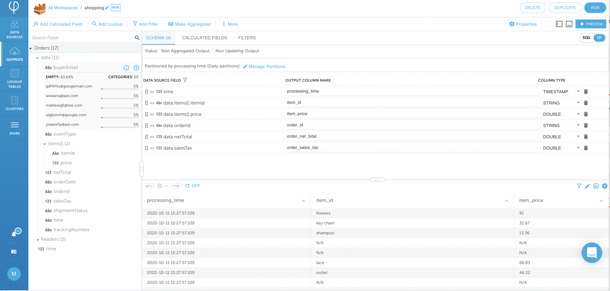

# Transform and write data to Amazon Athena


This tutorial uses pre-populated retail data and streams continuously to an Amazon Athena table. Upsolver supports many data sources and data outputs out-of-the-box. 


## 1. Create a data output

Click on **DATA OUTPUT &gt; NEW** and **SELECT** Amazon Athena 


Provide the Output a **NAME &gt; shopping** and choose **DATA SOURCES &gt; Orders** Click on **NEXT.** 



**Note:** The fields are automatically parsed and shown on the left hand side of the UI. Statistics and data distribution information for each field are also displayed.



From the Upsolver Transformation Screen, we can add columns to the output, create calculated fields, manage aggregations, and perform UPSERTs. Upsolver provides both a UI for building the transformations as well as a SQL interface.  This functionality makes Upsolver approachable to less technical users that may not be as familiar with big data technologies.

Please find a raw sample data coming from Amazon S3 below:

```text
{
"orderId": "abc",
"buyerEmail": "ben@upsolver.com",
"orderDate": "2020/07/07T01:00:00Z",
"items": [{"itemId": "widget","price": 19.99}, 
          {"itemId": "trinket","price": 9.99}],
"netTotal": 29.98,
"salesTax": 1.80
}

```

The desired output will be an Amazon Athena table, flattening the nested items into individual rows. In addition, the **buyerEmail** should be hashed to protect PII, and an **order\_grand\_total** will be added by summing up the **netTotal** and **salesTax.**


## 2. Map fields from the source to Amazon Athena

### Map source fields to output

The first transformation will be to add a column mapping for the Items. Expand the items array and click the **+** symbol next to **itemId** and **price** on the left-hand side.  Dismiss the warning\(s\) if you see them. 


You will see a warning regarding the mapping of NUMERIC fields to DOUBLE. This warning can be closed, as we want to keep the item price as a DOUBLE. 



### Add fields and edit the output field name

Click in the **OUTPUT COLUMN NAME** and change the column names from **data\_items\_itemsid** **&gt;** **item\_id** and **data\_items\_price &gt;** **item\_price**.


Click on the **PREVIEW** button, and verify that the output contains a row for each ordered item.


Add 3 more columns to the output and rename them **orderId &gt; order\_id**, **netTotal &gt; order\_net\_total**, and **salesTax &gt; order\_sales\_tax**. Dismiss the warnings.


## 3. Transform data by creating calculated field 


Upsolver provides over 200 built in functions out-of-the-box for easy data transformations. Additionally, users can extend the capability using Python UDFs.


### Transform DATE format

Click on **Add Calculated Field** on the upper left corner. Find the **TO\_DATE** function and click on **SELECT**. Under **DATETIME** type in **data.orderDate NAME &gt;** root.**order\_date** Click on **PREVIEW** to make sure the transformation looks ok. Click on **SAVE.**



### Mask field with MD5 hashing function

To protect PII, we're going to hash buyers' email addresses using the MD5 algorithm. Click on **Add Calculated Field**  on the upper left corner. Find **MD5** function and click on **SELECT**. Enter **INPUT &gt; data.buyerEmail** and **NAME &gt;** root.**buyer\_email\_hash** Click **PREVIEW** to make sure everything looks ok and then click on **SAVE.** 


**Note:** Upsolver provides a syntax sample for usage on the right to help you get started.



## 4. Use SQL interface for aggregation

Click over to the **SQL** tab by clicking SQL on the upper right corner. 



All of the transformations from previous steps are expressed as SQL. You will see that the existing mappings and transformations are expressed as SQL query. Any changes you make in the SQL view will also be represented in the UI view and vice-versa. 


Add a simple calculation field `data.netTotal + data.salesTax AS order_total:DOUBLE`  directly to the SQL. Notice that the added field is automatically reflected in the UI. Click on **PREVIEW** to make sure everything looks correct.



**Checkpoint**: your SQL should look like the code below. Copy/paste the SQL to your SQL tab if something is missing.


```sql
SET order_date = TO_DATE(data.orderDate);
SET buyer_email_hash = MD5(data.buyerEmail);
// GENERATED @ 2020-10-11T20:45:11.427116Z
SELECT time AS processing_time:TIMESTAMP,
       data.items[].itemId AS item_id:STRING,
       data.items[].price AS item_price:DOUBLE,
       data.orderId AS order_id:STRING,
       data.netTotal AS order_net_total:DOUBLE,
       data.salesTax AS order_sales_tax:DOUBLE,
       order_date AS order_date:TIMESTAMP,
       buyer_email_hash AS buyer_email_hash:STRING,
       data.netTotal + data.salesTax AS order_total:DOUBLE
  FROM "Orders"  

```

## 5. Connect to Amazon Athena

### Configure Amazon Athena run parameter

Click on **RUN** on the upper right corner and choose **S3 STORAGE &gt; S3 Default Output Storage**


Select **CONNECTION &gt; Create your first Amazon Athena Connection** and provide a **NAME &gt; athena** and leave everything else as the default value click on **CREATE**


Go back to the **RUN PARAMETER** screen by clicking on the **back button** of your browser **twice** and you should see **athena** populated under **CONNECTION**. Provide the **DATABASE NAME** that you want to output to. This example uses **upsolver**. TABLE NAME &gt; **orders** Click on **NEXT.**


Leave everything on **RUN** shopping as default and click on **DEPLOY**.


The output is continuous stream by leaving **ENDING AT** as **Never**, 



## 6. Verify data in Amazon Athena


In addition to transforming data to prepare it for querying, there is other behind-the-scenes optimizations that Upsolver performs to improve performance of Athena queries.  Not only does Upsolver utilize best practices such as using parquet format and partitioning data, but it also runs compaction to improve the underlying file size.  You can read more about compaction [here](https://www.upsolver.com/blog/small-file-problem-hdfs-s3).


Using Athena you can now query the data set created by Upsolver \(it may take a few minutes before the data is available\). Some sample queries that can be run are below:

Click [here](https://console.aws.amazon.com/athena/home?force&region=us-east-1) to login to Athena in order to run below queries

```sql
// get a list of orders

SELECT order_date,
         order_id,
         buyer_email_hash,
         order_net_total,
         order_sales_tax,
         order_total
FROM upsolver.orders
GROUP BY  1,2,3,4,5,6 limit 10
```

```sql
// how many orders per day?

SELECT count(distinct order_id) order_per_day,
         date_trunc('DAY',order_date) Date
FROM upsolver.orders
GROUP BY  date_trunc('DAY',order_date)
ORDER BY  date_trunc('DAY',order_date) DESC 
```

