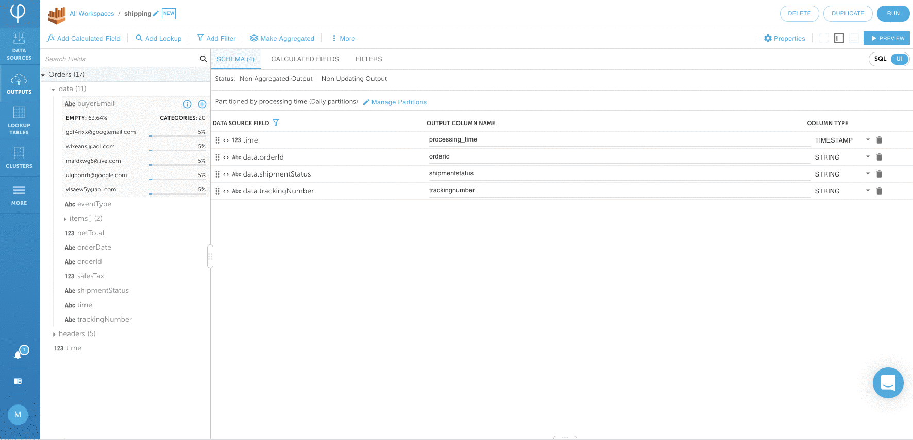

# UPSERT streaming data to Amazon Athena


An `UPSERT` \(`UPDATE` / `INSERT`\) is a common occurrence in Relational databases, but not as common in Data Warehouses and Data Lakes, which are typically append only.  Upsolver provides `UPSERT` functionality on systems that do not typically allow this functionality.

You can read more about how Upsolver accomplishes this in [this](https://www.upsolver.com/blog/solving-upserts-challenges-data-lakes) article.


In addition to the **shopping** table, In this section we will create an S3 data source for **shipping** data.  Follow the below steps to to build an output into Amazon Athena.

The output should be an UPSERTing table that contains the most recent shipping status for every order. Sample data:

```text
{
   "time": "2020/07/07 01:10:00",
   "orderId": "abc",
   "trackingNumber": "Z1234ABC",
   "shipmentStatus": "SHIPPED"
}
```

## 1. Create an Amazon Athena data output

Click on **DATA OUTPUT &gt; NEW** and **SELECT** **Amazon Athena output.** Give the output a **NAME &gt; shipping** and choose **DATA SOURCES &gt; Orders** Click on **NEXT** to continue.


## 2. Map fields from source to Amazon Athena

Map **orderId**, **trackingNumber**, and **shipmentStatus** to Amazon Athena table by clicking on the **+** sign next to each field. 


## 3. Define the key field used to UPSERT 

Click on **MORE &gt; Manage Upserts** find the **orderid** field and check under **USE AS KEY.** Click on **CLOSE**. Switch over to the SQL UI and click on **PREVIEW** to make sure everything looks as expected. Click on **RUN**.



```sql
// Copy and paste the UPSERT SQL to your UI if it looks different 
// from your environment.

SELECT data.orderId AS orderid:STRING,
       time AS processing_time:TIMESTAMP,
       data.shipmentStatus AS shipmentstatus:STRING,
       data.trackingNumber AS trackingnumber:STRING
  FROM "Orders"  
    REPLACE ON DUPLICATE data.orderId

```

## 4. Start streaming data to Amazon Athena table

Choose the **DATABASE NAME &gt; upsolver** and **TABLE NAME &gt; shipping** Click on **NEXT**.


Leave everything on the Run page as default and click on **DEPLOY**. 


The output is continuous stream by leaving **ENDING AT** as **Never**, 



Wait for the data stream start writing to Amazon Athena tables.


## 4. Verify data on Amazon Athena


When Upsolver creates an upserting output to Athena, it creates two objects: a table with the suffice `_underlying_data` and a view with the output name. It's recommended to query the VIEW, and not the underlying table.


Query the shipping data set created by Upsolver \(it may take a few minutes before the data is available\).

Sample queries:

```sql
// What is the current shipping status of order 57459731866?

SELECT shipmentstatus
FROM upsolver.shipping
WHERE orderid = '57459731866'
```


```sql
// What are the tracking numbers of all items that have been shipped?

SELECT trackingnumber
FROM shipping
WHERE shipmentstatus = 'SHIPPED'
```


