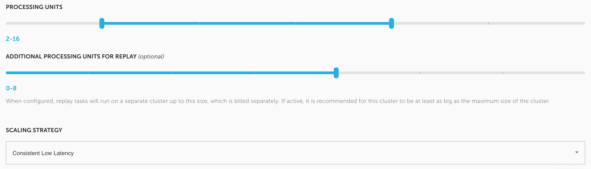

# FAQ

## Contents:

* \*\*\*\*[**Commercial and pricing**](faq.md#commercial-and-pricing)\*\*\*\*
  * [Is it possible to add Upsolver to AWS billing?](faq.md#is-it-possible-to-add-upsolver-to-aws-billing)
  * [How is Upsolver priced?](faq.md#how-is-upsolver-priced)
  * [Is it possible to try Upsolver?](faq.md#is-it-possible-to-try-upsolver)
  * [What is Upsolver's support model?](faq.md#what-is-upsolvers-support-model)
* \*\*\*\*[**Features and functionality**](faq.md#features-and-functionality)\*\*\*\*
  * [Does Upsolver support databases as input sources?](faq.md#does-upsolver-support-databases-as-input-sources)
  * [How does Upsolver handle data retention?](faq.md#how-does-upsolver-handle-data-retention)
  * [Does Upsolver support batch loads or only streaming?](faq.md#does-upsolver-support-batch-loads-or-only-streaming)
  * [Can Upsolver work in a hybrid on-premises and cloud environment?](faq.md#can-upsolver-work-in-a-hybrid-on-premises-and-cloud-environment)
  * [How does Upsolver handle missing data?](faq.md#how-does-upsolver-handle-missing-data)
  * [Can Upsolver handle large volumes of messages per second?](faq.md#can-upsolver-handle-large-volumes-of-messages-per-second)
  * [Can I edit existing tables to reflect changes in the data?](faq.md#can-i-edit-existing-tables-to-reflect-changes-in-the-data)
  * [Can I send messages from the same input to different output fields?](faq.md#can-i-send-messages-from-the-same-input-to-different-output-fields)
  * [Does creating different outputs from the same input require reading data source \(e.g. Amazon Kinesis\) multiple times?](faq.md#does-creating-different-outputs-from-the-same-input-require-reading-data-source-e-g-amazon-kinesis-multiple-times)
  * [Can Upsolver be used with Snowflake?](faq.md#can-upsolver-be-used-with-snowflake)
  * [How does the system scale?](faq.md#how-does-the-system-scale)
  * [How is the system managed?](faq.md#how-is-the-system-managed)
  * [How can I learn how to use Upsolver?](faq.md#how-can-i-learn-how-to-use-upsolver)
  * [How is the Upsolver application being updated?](faq.md#how-is-the-upsolver-application-being-updated)
  * [Can I monitor Upsolver using my own monitoring system?](faq.md#can-i-monitor-upsolver-using-my-own-monitoring-system)
  * [What infrastructure does Upsolver run on
    ?](faq.md#what-infrastructure-does-upsolver-run-on)
  * [Can Upsolver be used in an event-based use case
    ?](faq.md#can-upsolver-be-used-in-an-event-based-use-case)
  * [From which sources can I ingest data to Upsolver?](faq.md#from-which-sources-can-i-ingest-data-to-upsolver)
  * [To which targets can I send my data using Upsolver?](faq.md#to-which-targets-can-i-send-my-data-using-upsolver)
  * [Does Upsolver support upserts?](faq.md#does-upsolver-support-upserts)
  * [How do upserts work?](faq.md#how-do-upserts-work)
  * [How does compaction work?](faq.md#how-does-compaction-work)
  * [How does Upsolver handle failures?](faq.md#how-does-upsolver-handle-failures)
  * [Can Upsolver be used in a timer-based use case
    ?](faq.md#can-upsolver-be-used-in-a-timer-based-use-case)
* \*\*\*\*[**Upsolver on AWS**](faq.md#upsolver-on-aws)\*\*\*\*
  * [Can you use Upsolver to join multiple Kinesis streams?](faq.md#can-you-use-upsolver-to-join-multiple-kinesis-streams)
  * [How do I select which metadata and model to query on S3?](faq.md#how-do-i-select-which-metadata-and-model-to-query-on-s-3)
  * [Does Upsolver store the original JSON messages on S3?](faq.md#does-upsolver-store-the-original-json-messages-on-s-3)
  * [Can Upsolver work with Redshift Spectrum or Presto over EMR?](faq.md#can-upsolver-work-with-redshift-spectrum-or-presto-over-emr)
  * [How quickly will my streaming data be available in Athena?](faq.md#how-quickly-will-my-streaming-data-be-available-in-athena)
  * [How does Upsolver output data to Athena?](faq.md#how-does-upsolver-output-data-to-athena)
  * [How do you ensure that Athena tables are efficiently queryable over time? Do you change the partition or files over time?](faq.md#how-do-you-ensure-that-athena-tables-are-efficiently-queryable-over-time-do-you-change-the-partition-or-files-over-time)
* \*\*\*\*[**Under the hood**](faq.md#under-the-hood)\*\*\*\*
  * [Does Upsolver ETL the data before or after ingesting it into the data lake?](faq.md#does-upsolver-etl-the-data-before-or-after-ingesting-it-into-the-data-lake)
  * [How does Upsolver handle data integration?](faq.md#how-does-upsolver-handle-data-integration)
  * [Where does Upsolver create and store indexes?](faq.md#where-does-upsolver-create-and-store-indexes)
* \*\*\*\*[**Privacy and security**](faq.md#privacy-and-security)\*\*\*\*
  * [Does Upsolver store user data or PII?](faq.md#does-upsolver-store-user-data-or-pii)
  * [How does Upsolver handle data privacy issues for compliance with HIPAA, GDPR, etc.?](faq.md#how-does-upsolver-handle-data-privacy-issues-for-compliance-with-hipaa-gdpr-etc)
  * [What level of security does Upsolver offer?](faq.md#what-level-of-security-does-upsolver-offer)
  * [What kind of access control does Upsolver provide?](faq.md#what-kind-of-access-control-does-upsolver-provide)
* \*\*\*\*[**Upsolver CI/CD**](faq.md#upsolver-ci-cd)\*\*\*\*
  * [How do you move data pipelines from development to production?](faq.md#how-do-you-move-data-pipelines-from-development-to-production)
  * [How do you backup ETL code?](faq.md#how-do-you-backup-etl-code)
  * [How to manage Upsolver's infrastructure as code?](faq.md#how-to-manage-upsolvers-infrastructure-as-code)

## Commercial and pricing

### Is it possible to add Upsolver to AWS billing?

Yes — when you’re buying Upsolver from the [AWS marketplace](https://aws.amazon.com/marketplace/pp/B07T8JDQ57?ref_=srh_res_product_title), you’re actually adding Upsolver to your AWS bill. 

Through the marketplace, you can choose to purchase Upsolver units on-demand and pay on a monthly or yearly basis. 

We also offer reduced pricing for annual contracts, which can also be purchased through the marketplace after contacting us, and this will also be charged as part of your AWS bill.

### How is Upsolver priced?

Upsolver a compute-based model where pricing is based on Upsolver’s usage of EC2 servers. 

To reduce costs, Upsolver uses EC2 spot instances under the hood. You pay for the price of the spot instance with an additional markup for Upsolver’s software, but you only pay for actual data being processed by Upsolver. 

To request a personalized live quote, visit our [pricing page](https://www.upsolver.com/pricing).



### **Is it possible to try Upsolver?**

You can start a free trial of Upsolver, either on [upsolver.com](https://www.upsolver.com/) or through the [AWS marketplace](https://aws.amazon.com/marketplace/pp/B07T8JDQ57?ref_=srh_res_product_title); it will last for 14 days and also includes extensive support from the Upsolver teach team, with both hands-on training as well as technical consultation. 

We help you define the use cases and how to best implement them, and we make sure that you’re getting something that works on a production scale before you decide to spend a single dollar.

### **What is Upsolver's support model?**

For ongoing support we are available via In-app chat, Slack, and video calls as needed. We also provide 24/7 phone response for critical issues, based on agreed-upon metrics which we continually monitor.

## Features and functionality

### Does Upsolver support databases as input sources?

Upsolver supports additional databases as sources using Amazon’s Data Migration Service \(DMS\); Upsolver can read the inputs generated by DMS, write them to S3, and create corresponding tables in Athena or use them for other ETL pipelines. 

As such, Upsolver can support any of the databases supported by DMS.

### **How does Upsolver handle data retention?**

Users can define retention policies for every object in Upsolver, whether it’s a data source or an output, and Upsolver will automatically delete data after that period. 

Before deleting, Upsolver will also check to see if the files are needed for any ETL process; this minimizes errors in comparison to manually deleting folders on S3.

### **Does Upsolver support batch loads or only streaming?**

Upsolver supports batch data loads but it is built on a streaming-first architecture.

For example, if you’re looking to output data once an hour and then query the aggregated data to reduce costs and latency — Upsolver can run that batch operation, but under the hood, it will use stream and micro-batch processing to process every event at a time and will use indexing to join with historical data.

### **Can Upsolver work in a hybrid on-premises and cloud environment?**

Upsolver’s native connectors to Kafka and HDFS allow you to ingest data from on-premises deployments into the cloud, where the data processing is currently done.

### **How does Upsolver handle missing data?**

Upsolver’s S3-to-S3 architecture ensures exactly-once processing, meaning that there will be no duplicate or missing data.

### **Can Upsolver handle large volumes of messages per second?**

In the Upsolver architecture, storage and compute are decoupled. Upsolver handles increases in message volume by scaling out the compute cluster. 

You can choose a scaling strategy to keep consistent low latency.

### **Can I edit existing tables to reflect changes in the data?**

Yes, Upsolver allows you to alter existing tables in Athena, including adding new columns to a table that’s already in use. These changes will take effect both proactively and retroactively, depending on the timestamp you choose.

### **Can I send messages from the same input to different output fields?**

Yes, using the Upsolver UI, you can define filters that will apply to that output, based on a field \(or fields\) from the event stream. 

For highly complex parsing, you should use the Upsolver API.

### **Does creating different outputs from the same input require reading data source \(e.g. Amazon Kinesis\) multiple times?**

The source will only be read a single time.

Data is written to S3 and then distributed to multiple outputs. We do this because keeping a copy of the raw data on S3 is cheaper than Kinesis/Kafka, allows the data retention to be longer, and leaves no risk that one output will cause slowdowns in other outputs.

### **Can Upsolver be used with Snowflake?**

Yes. For Snowflake, Upsolver will store the data on Amazon S3 and Snowflake will read from there.



### **How does the system scale?**

Storage and compute are decoupled. S3 is used for storage and EC2 Spot instances are used for compute. Scaling is linear since local disks are not used at all.

### **How is the system managed?**

Upsolver manages the cluster remotely, including troubleshooting, version updates, scaling, and monitoring.

### **How can I learn how to use Upsolver?**

Our [documentation](../../) and Support team are always available to get you started and assist along the way. We also provide an on-demand online training course. For more information, please contact our team.

### **How is the Upsolver application being updated?**

Upsolver is a cloud-based SaaS; as such, the Upsolver application is updated from the cloud periodically. 

The process is gradual and the service remains available during the entire update process with zero downtime.

### **Can I monitor Upsolver using my own monitoring system?**

Yes. Upsolver’s monitoring solution enables sending pre-configured metrics to your existing monitoring system. Supported monitoring systems are Datadog, Amazon CloudWatch, InfluxDB, Elasticsearch, SignalFx, and others per request.

### **What infrastructure does Upsolver run on
?**

Upsolver runs in the cloud. We currently support Amazon Web Services and we will soon add support for Microsoft Azure.

### **Can Upsolver be used in an event-based use case
?**

Yes. Please contact the Upsolver Support team so we can customize a solution for this use-case for you.

### **From which sources can I ingest data to Upsolver?**

Upsolver supports data ingestion from several types of sources such as databases, streaming services \(e.g. Amazon Kinesis, Apache Kafka\), and object store services \(e.g. Amazon S3. Google Cloud Storage\).



### **To which targets can I send my data using Upsolver?**

Upsolver supports sending your data to various types of destinations such as distributed SQL query engines \(e.g. Amazon Athena\), databases and data warehouses, streaming services \(e.g. Amazon Kinesis, Apache Kafka\), and object store services \(e.g. Amazon S3, Google Cloud Storage\).



### **Does Upsolver support upserts?**

Yes.



### How do upserts work?

Upserts add the ability to upsert and delete events in data lakes; they are only supported for some of the data outputs.

Upsolver enables you to configure two types of keys in the output: **upsert** and **delete**.

These keys are used by Upsolver to perform update and delete operations on the output and might be used on existing fields in the data or new calculated field added to your data.

Upsert keys are used by Upsolver to keep only the latest event per upsert key, while events with the value **`true`** in their deletion key field are deleted.

Both upsert and delete operations take place during Upsolver’s compaction process.

### **How does compaction work?**

Compaction is a process in which small files are being merged into one bigger file for improved performance.

#### An overview of the process:

1. Upsolver ingests the raw data partitioned to Amazon S3.

2. When compaction takes place, only the last events per upsert key are kept. Events marked for deletion based on the delete key are deleted.

3. The final table in Athena points to a view which “unions” \(contains the latest data per upsert key and removed events which have the value **`true`** in their delete key field\) both the insert and update partitions. This view is necessary, otherwise upserts/delete operations are not reflected in real-time until the compaction process ends.

Read more on compaction on this blog post:



### **How does Upsolver handle failures?**

Full traceability \(Event Sourcing\) is built into the platform. 

Upsolver’s architecture follows event sourcing principles and is based on an immutable log of all incoming events. These events are then processed with Upsolver ETL to create a queryable copy of the data. 

Unlike databases where the state constantly changes \(making it difficult to reproduce its original state without configuring a change-log\), in Upsolver you can always "go back in time" and retrace your steps to learn about the exact transformation applied on your raw data, down to the event level.

You can fix a bug in your ETL and then run it using the immutable copy of your raw data.

### **Can Upsolver be used in a timer-based use case
?**

Yes. Please contact the Upsolver Support team so we can customize a solution for this use-case for you.

## Upsolver on AWS

### Can you use Upsolver to join multiple Kinesis streams?

Yes! Each Kinesis Stream will be a data source in Upsolver, and you can join any two data sources together: Kinesis-Kafka, Kinesis-Kinesis, Kinesis-S3, S3-S3. Any combination would work out of the box.

### **How do I select which metadata and model to query on S3?**

With Upsolver, this would be done using SQL; when you write your query, you define the schema that you’re going to create in Athena. This can also be done via the visual UI which allows you to select fields within your data sources to populate Athena tables.

### **Does Upsolver store the original JSON messages on S3?**

The historical JSON files are batched together and kept in compressed Avro for higher performance and lower cost of storage. Access to historical data is available via the Replay feature.

### **Can Upsolver work with Redshift Spectrum or Presto over EMR?**

Yes. Upsolver stores all metadata in the Glue Data Catalog so that once you’ve created a table in Athena, it can also be immediately accessed in Redshift Spectrum or Presto over EMR, which also read metadata from Glue.

### **How quickly will my streaming data be available in Athena?**

Using Upsolver, your data should be available in Athena within 5 minutes of appearing in Kafka; sometimes it may be even faster and appear in just 2-3 minutes.

### **How does Upsolver output data to Athena?**

Upsolver offers unique end-to-end integration with Amazon Athena. Tables are created via Glue Data Catalog, to which Upsolver will:

* optimize S3 storage for performance
* make data available in Athena in near real-time to Athena
* add ability to define updatable tables in Athena \(for CDC\)
* add option to edit tables
* add historical replay / time-travel

### **How do you ensure that Athena tables are efficiently queryable over time? Do you change the partition or files over time?**

Upsolver continuously optimizes your S3 storage to ensure high query performance in Athena. 

We start with 1-minute Parquet files \(for latency reasons\) and compact the files into bigger files for performance. Upsolver will keep the table data consistent using the Glue Data Catalog.

## Under the hood

### Does Upsolver ETL the data before or after ingesting it into the data lake?

Both! When Upsolver connects to data sources such as Apache Kafka, it serializes all the data from Kafka into an S3 bucket; after performing transformations, every operation is written back to separate storage on S3. 

By creating this architecture that leverages two layers of storage on S3, we can guarantee exactly-once processing without data loss or duplication.

### **How does Upsolver handle data integration?**

Upsolver uses its own data processing-engine coded entirely in Scala and leverages a fully decoupled architecture. This enables all the processing to be done on EC2 without using any local storage and using only S3 for storage.

### **Where does Upsolver create and store indexes?**

Upsolver’s indexes are lookup tables, which are also stored on Amazon S3. 

These indexes are loaded into memory when you’re actually running the ETL. Thanks to Upsolver’s breakthrough compression technology, you can store much larger indexes in RAM without managing NoSQL database clusters.

## Privacy and security

### Does Upsolver store user data or PII?

Upsolver doesn’t store any customer data. 

Upsolver stores all the data it processes on an S3 bucket on the customer accounts. When Upsolver is deployed on private VPC, even Upsolver employees don’t have access to the data. 

The only data sent to Upsolver is billing information and monitoring information to support your deployments remotely. This means there are no issues around compliance, PCI, or PII when using Upsolver.

### **How does Upsolver handle data privacy issues for compliance with HIPAA, GDPR, etc.?**

Upsolver gives you on-premises level data privacy, in the cloud — even Upsolver employees don’t have access to the data \(when in private VPC\). Users can also implement masking as part of the ETL process.

### **What level of security does Upsolver offer?**

Upsolver is as secure as your AWS account — it can be deployed in your private VPC, which means that even Upsolver employees will not have access to the data. Alternatively, you can deploy on Upsolver’s VPC on AWS.

### **What kind of access control does Upsolver provide?**

You can define read-only users in Upsolver and grant/deny permissions to every object using a similar model to AWS IAM. You can also create separate workspaces to reduce complexity.



## Upsolver CI/CD

### How do you move data pipelines from development to production?

Upsolver provides complete separation between your development and production environments, which can be applied to all the entities configured in your Upsolver account. 

When you are done developing and testing your ETL in your development environment, deploying it to production takes just a few clicks. You use the same ETL you already tested and developed in your dev environment and run it on top of your production data streams.

### How do you backup ETL code?

Backing up your ETL code is being done using Upsolver’s Git integration feature. Using this functionality allows you to use all the familiar Git capabilities such as source code version management, collaboration, and code ownership.

### How to manage Upsolver's infrastructure as code?

Upsolver provides a REST API that enables you to manage all Upsolver’s infrastructure from your code. This allows you to perform all the operations performed from Upsolver’s UI using our API in your code if you prefer to do so.

