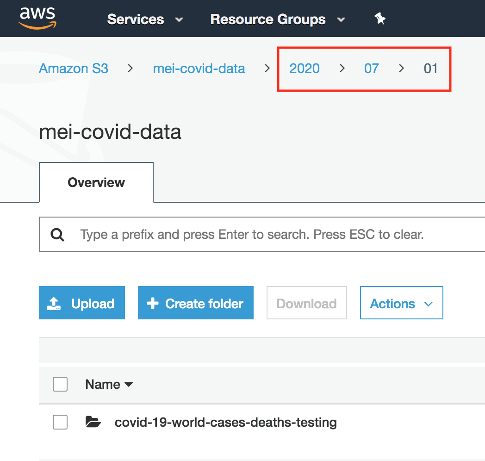
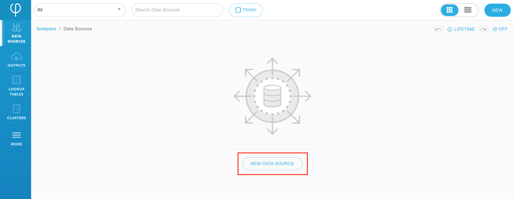
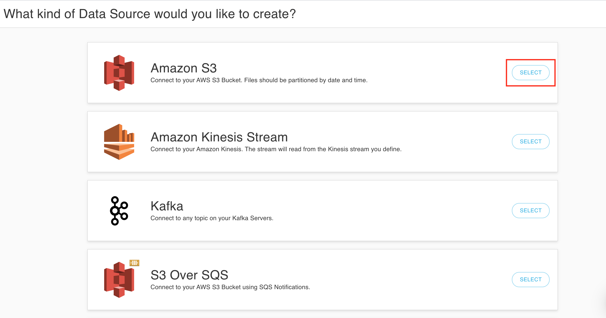

# Create an Amazon S3 data source




If you haven’t signed up for Upsolver yet, follow this guide to [deploy Upsolver](../../start-using-upsolver/upsolver-deployment-guide.md). 


Upsolver supports ingesting all data formats from various data source types including but not limited to:  

* [Amazon S3](../../../connecting-data-sources/amazon-aws-data-sources/amazon-s3-data-source/)
* [Amazon Kinesis Stream](../../../connecting-data-sources/amazon-aws-data-sources/amazon-kinesis-stream-data-source.md)
* [Kafka](../../../connecting-data-sources/kafka-data-output.md)
* [Amazon S3 over SQS](../../../connecting-data-sources/amazon-aws-data-sources/amazon-s3-over-sqs-data-source.md)
* [Microsoft Azure Blob storage](../../../connecting-data-sources/microsoft-azure-data-sources/microsoft-azure-blob-storage-data-sou.md)
* [Google Cloud Storage](../../../connecting-data-sources/google-cloud-storage-data-source.md)
* [File upload ](../../../connecting-data-sources/additional-data-sources.md)
* [JDBC](../../../connecting-data-sources/jdbc.md)
* [Microsoft Azure Events Hub](../../../connecting-data-sources/microsoft-azure-data-sources/microsoft-azure-events-hub-data-source.md)
* [HDFS](../../../connecting-data-sources/hdfs-data-source.md)

Upsolver can read events directly from your Amazon S3 bucket where the data should be partitioned by event date. 

This guide is using COVID-19 data from Amazon AWS, but you can also follow along with your own dataset.

## Create an S3 bucket with sample data

1. Download a COVID-19 test data set from [here](https://drive.google.com/file/d/1YsM5XtlYhiqFV3BND2pN3A9UcxNXe42u/view?usp=sharing) \(July 1, 2020\). You can subscribe to [Amazon AWS COVID-19 testing data](https://aws.amazon.com/marketplace/pp/Coronavirus-Disease-COVID-19-Testing-Data-The-COVI/prodview-a2ev4blctqkwc) for the most up-to-date data sets, or you can use your own data set.

2. Create a S3 bucket in **your own AWS account** with data partitioned by date. Since the data set being used here is from July 1, 2020, put the CSV file under `2020/07/01`.

## Create a new Amazon AWS S3 data source

1. From your **Upsolver UI**, click on **New Data Source**.

2. Select **Amazon S3** as your data source type.

3. Since Upsolver is integrated with your S3 storage, your buckets are automatically detected. Select the **bucket** in which your data is located.

4.  The **Date Pattern** should match how S3 bucket data is partitioned from step 2.


**Example:** For `2020/07/01`, the **Date Pattern** should be `yyyy/MM/dd/`.


5. Choose CSV as the **Content Format**. 


Keep in mind that Upsolver supports all file formats and that different data types provide various options to parse the data. CSV is just being used as an example here.  
**See:** [Data formats](../../glossary/data-formats.md)


For CSV files, you should check **Infer Types** if you wish to auto-detect data types; otherwise, Upsolver will take in each field as a **string**. 

You can also optionally define the headers of the columns you want to load under **Header** and define your own delimiter under **Delimiter**.

6. Click **Continue**. 

7. Click **Launch Integration** to integrate your S3 bucket with Upsolver; a CloudFormation page will open up in a new tab.

8. Scroll down the CloudFormation page and check the **I acknowledg**e statement. Then click on **Create stack**.

9. Within a minute or so, the stack should be fully created, indicated by its status which should now be `CREATE_COMPLETE`.

10. Go back to the Upsolver UI and click on **Done**. 

11. You will be shown a sample of the parsed data. If everything looks OK, click **Create**.


Congratulations! You have successfully created an Amazon S3 data source. You can click on the **Parse Errors** tab to ensure everything was parsed properly.


