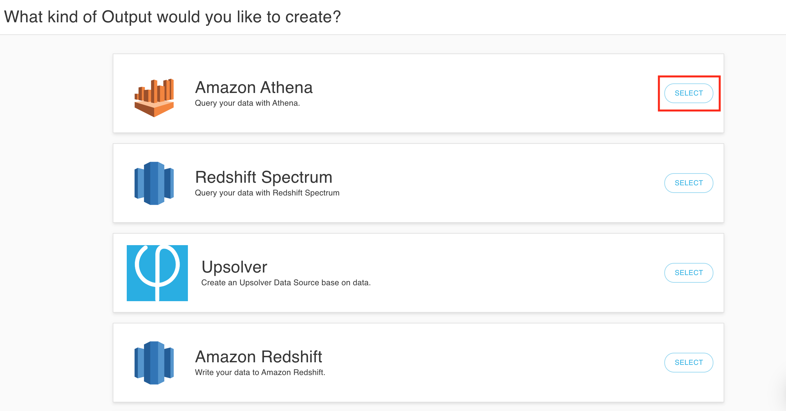

# Join multiple data streams for real-time analytics




Before performing a join on multiple data streams, you must have already [deployed Upsolver](../../start-using-upsolver/upsolver-deployment-guide.md) and [created data sources](../../../connecting-data-sources/amazon-aws-data-sources/amazon-s3-data-source/quick-guide-s3-data-source-1.md).


Performing a join on multiple data streams is easy with Upsolver. 

This guide provides the instructions on joining: 

* `impressions`: primary data source with ad campaign information
* `clicks`: secondary data stream tracking number of clicks on an ad


**Note:** All clicks will be associated with an ad impression, but not all ad impressions will result in clicks.


## Create an Athena data output and define a data source


1. Click on **Outputs** on the left and then **New** on the right upper corner.


2. **Select** Amazon Athena as the data output.



3. Click **Add** to add as many data sources as you need. Click **Next** to continue.


## Join two data streams together and perform data transformation


1. Select the SQL window from the upper right hand corner.


2. The sample SQL below performs a `LEFT OUTER JOIN` between `impressions` and `clicks` data streams. 

Behind the scenes, the `LEFT OUTER JOIN` is creating a lookup table, enabling users to index data by a set of keys and then retrieve the results in milliseconds.


```sql
SELECT data.id AS impression_id, 
    data.win_timestamp AS impression_time, 
    data.campaign_id AS campaign_id, 
    data.exch_user AS user_id, 
    IF_ELSE(click_data.click_time IS NULL, 0, 1) AS is_click 
        -- if click_time exists returns 1, else returns 0
FROM Impressions LEFT OUTER JOIN 
    (SELECT data.id AS imp_id, 
        LAST(data.click_timestamp) AS click_time 
            -- last click_timestamp is the click_time
    FROM Clicks GROUP BY data.id) 
AS click_data WAIT 10 MINUTES ON click_data.imp_id = data.id 
    -- wait for 10 minutes before performing the join since clicks usually arrive after impressions.
```



Read more about Upsolver lookup tables [here](https://www.upsolver.com/blog/lookup-tables-decoupled-alternative-cassandra).


## Define Athena output parameters


1. Define storage, database, and table information for your Athena environment and click **Next**.


2. Define the **compute cluster** that you would like to use and the **time range** of the data you would like to output. 


Keep in mind that setting **Ending At** to **Never** means the output will be a continuous stream. 


3. Click **Deploy**.


## Check output data and run analytics

1. Check to make sure the output data is up to date by clicking on the **Progress** tab.


2. Run a query in Athena to make sure you get the correct results.


```sql
SELECT campaign_id, 
    SUM(is_click)/COUNT(*) AS CTR
        -- to get the click through rate: 
        -- divide the sum of clicks for a campaign with the total number of impressions 
FROM impression_clicks
GROUP BY campaign_id
```



## What’s next?



