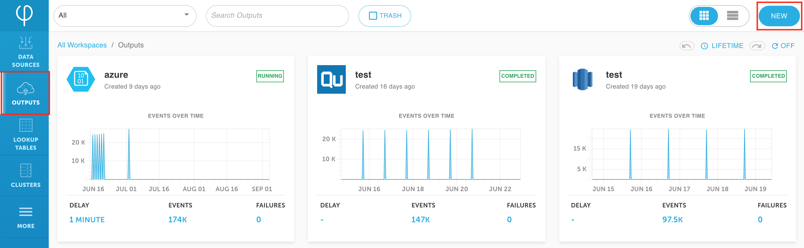

# Use Upsolver to index less data into Splunk



This guide provides an example of how to index less data into Splunk and thereby reduce your Splunk cost.


Before we begin, you should have already [deployed Upsolver](../../start-using-upsolver/upsolver-deployment-guide.md) and[ created data sources](../../../connecting-data-sources/amazon-aws-data-sources/amazon-s3-data-source/quick-guide-s3-data-source-1.md).


## Upsolver architecture for various data structures

The Upsolver architecture liberates your data from vendor lock-in; it allows many ways of analyzing data including SQL engine, Machine Learning, and Searching. Many Upsolver users utilize Athena to run SQL on log data.


## Create an Amazon S3 data output

1. Click on **Outputs** on the left and then click **New** on the right upper corner.



2. **Select** Amazon S3 as your data output.


3. Give the data output a **name** and define your output format \(**tabular** or **hierarchical**\). 

4. Select your **data sources**. This guide uses [AWS VPC Flow Logs](https://docs.aws.amazon.com/vpc/latest/userguide/flow-logs.html).


5. Click **Next** to continue.

## Use the UI or SQL to aggregate data before sending to Splunk

1. Select the SQL window from the upper right hand corner. Keep in mind that everything that you do on the UI will be reflected in SQL and vice versa. 


2. The sample SQL below aggregates multiple values together for a given period of time, reducing the amount of data being sent to Splunk.


```sql
SELECT data."account-id" AS ACCOUNT_ID, 
    data.action AS action, 
    SUM(TO_NUMBER(data.bytes)) AS SUM_BYTES, 
    SUM(TO_NUMBER(data.packets)) AS SUM_PACKETS, 
    COUNT(*) AS count
FROM “bhopp-vpc-flowlogs”
GROUP BY data."account-id", data.action
```


3. Click on **Properties** on the upper right hand corner.


4. Under **Scheduling**, change the **Output Interval** to your desired length. 


This property defines how frequently Upsolver outputs the aggregated data, with the default being 1 minute.



5. Click **Run** on the upper right hand corner.


## Define Amazon S3 output parameters

1. Define the **Output Format** and the **S3 Connection** information; then click **Next**. 


Keep in mind that Upsolver supports all file types.



2. Define the **compute cluster** that you would like to use and the **time range** of the data you would like to output. 


Keep in mind that setting **Ending At** to **Never** means the output will be a continuous stream. 


3. Click **Deploy**.


## Configure Splunk environment to read data from S3

While waiting for the data to write to the output, configure the Splunk environment to read from S3; this guide uses a size `t2.large` Splunk instance. 


If you don’t have a Splunk environment, you can easily [start up a Splunk instance](https://aws.amazon.com/marketplace/pp/B00PUXWXNE) in the same environment in which Upsolver is deployed.


1. After logging in, click on **Find More Apps**.


2. Find the **Splunk Add-on for Amazon Web Services** app and click **Install**.


3. Fill out your login information for [Splunk.com](http://www.splunk.com/). Check the license and agreement box and click **Login and Install.**


If you don’t have an account, click on [FREE SPLUNK](http://www.splunk.com/) on the upper right hand corner and sign up for a free account.



4. The installation might take a few seconds and Splunk will prompt you to restart. Click **Restart Now**.


5. Login to your Splunk environment again and click on the Splunk Enterprise logo. Then click **Splunk Add-on for AWS**.


6. Click on the **Configuration** tab and then click **Add** on the right.


7. Give your Account a name \(make sure to remember this name, we will use it for the data input next\). Fill out your **AWS Access Key \(Key ID\)** and **Secret Key** information then click **Add**.


8. Click on **Settings** **&gt;** **Data inputs** on your Splunk UI’s upper right hand corner.


9. Find and select **AWS S3** data input \(most likely on page 2\).


10. Give the data input a **name** and fill out your **AWS Account** information. It should be the same **Account Name from step 5**. 

11. Give it a **bucket name**. This must match the bucket name on your AWS account where the output data is being stored. 

12. Change the **Polling interval** to **10**. Define **Key prefix** as your S3 folder path.


13. Scroll down and check **More settings** to configure additional setting options. 

14. Change **Set sourcetype** to **From list**, and select **json\_no\_timestamp** from the **Select sourcetype from list** dropdown. Then click **Next**.


15. Click **Start searching**.


## Verify data in Splunk

1. Click on **Data Summary** under What to Search.


2. Click on **Sourcetype** and **json\_no\_timestamp.**


3. Verify your indexed data is the same as the aggregated data from Upsolver. Success!


## What’s next?



