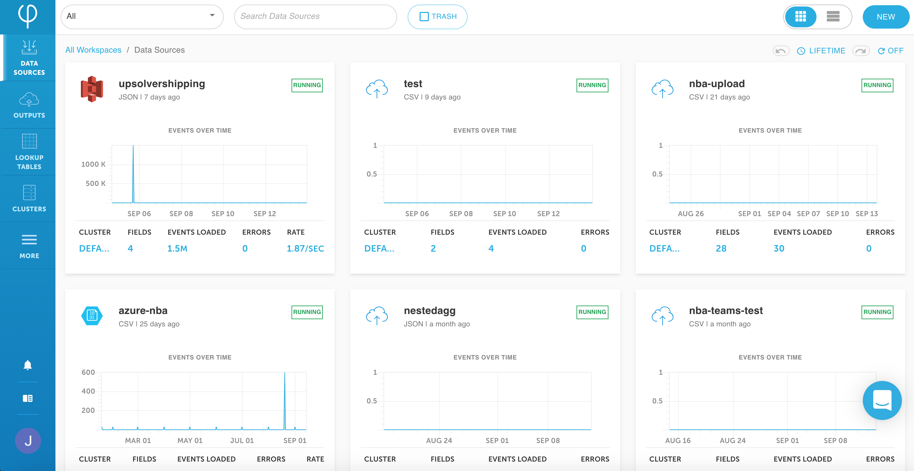

# Data ingestion

Upsolver supports ingesting data from various data source types. These data sources can be logically divided into two types:

* File based data sources
  * [Amazon S3](../../connecting-data-sources/amazon-aws-data-sources/amazon-s3-data-source/)
  * [Amazon S3 over SQS](../../connecting-data-sources/amazon-aws-data-sources/amazon-s3-over-sqs-data-source.md)
  * Amazon AppFlow \(coming soon\)
  * [Microsoft Azure Blob Storage](../../connecting-data-sources/microsoft-azure-data-sources/microsoft-azure-blob-storage-data-sou.md)
  * [Google Cloud Storage](../../connecting-data-sources/google-cloud-storage-data-source.md)
  * [File upload](../../connecting-data-sources/additional-data-sources.md)
  * [JDBC](../../connecting-data-sources/jdbc.md)
  * [HDFS](../../connecting-data-sources/hdfs-data-source.md)
* Event based data sources
  * [Amazon Kinesis Stream](../../connecting-data-sources/amazon-aws-data-sources/amazon-kinesis-stream-data-source.md)
  * [Kafka](../../connecting-data-sources/kafka-data-output.md)
  * [Microsoft Azure Events Hub](../../connecting-data-sources/microsoft-azure-data-sources/microsoft-azure-events-hub-data-source.md)

## File based data sources

Upsolver lists files from the data source bucket, it creates a list of all the files that need to be loaded. The pull operation happens every minute by default. Upsolver then takes the list of files, parses the data and pushes them in a parsed folder. The parsed folders are going to be the same for both file based and event based data.

File based data sources Upsolver reinforces Exactly-once Semantics by

1. Send metadata on which files exist
2. Store that which files exist in the Kinesis stream
3. Read existing files information from the Kinesis stream to ensure exactly-once processing

## Event based data sources

Event based data sources Upsolver reinforces exactly-once by:

1. Find the events up until which timestamp/offset have already been pulled
2. Write the information to the Kinesis stream
3. Read offset information from the Kinesis stream to ensure exactly-once processing

The **Data Sources** page shows all your active data sources in a grid view and you can filter the data sources according to type. 

For example, you can select to view the Amazon S3 data sources only, select whether to view the **Active** or **Deleted** data sources, and flip between the grid and list views. You can also search for specific data sources.

The data source panel shows you the name of the data source, the file format ingested, when it was created, and whether it is **Running**. The graph shows you the volume of events over time, and you can mouse over the graph to view the details for a specific time period.

You can also view: 

* the compute cluster for the data source
* how many fields are being ingested
* number of events loaded to date
* number of errors
* rate of ingestion

